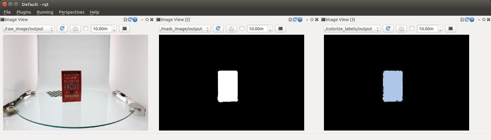

mask_image_to_label.py
======================

What is this?
-------------

Publish an label image converted by mask image.

Subscribing Topic
-----------------

* ``~input`` (``sensor_msgs/Image``)

  Mask image.

Publishing Topic
----------------

* ``~output`` (``sensor_msgs/Image``, ``encoding: 32SC1``)

  Label image.

Sample
------

::

roslaunch jsk_perception publish_fixed_images.launch
