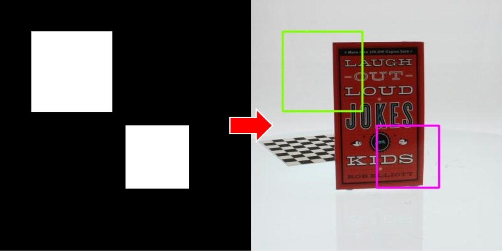

# MaskImageToRect


Convert a mask image into jsk_recognition_msgs/RectArray.

## Subscribing Topic
* `~input` (`sensor_msgs/Image`)

  Input mask image.

## Publishing Topic
* `~output` (`jsk_recognition_msgs/RectArray`)

  An array of rectangles contains rectangles. They are bounding rectangles of the input mask.

## Parameters

* `~rect_type` (Int, default: `0`)

   Specify output rect types.

   0: Outputs a rect that encloses the entire mask.

   

   1: Outputs bounding rectangles containing each contour that is output by applying opencv's `findContours` with `CV_RETR_EXTERNAL` to the mask image.

   

## Sample

```bash
roslaunch jsk_perception sample_mask_image_to_rect.launch
```
