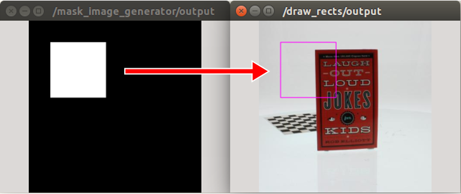

# MaskImageToRect


Convert a mask image into jsk_recognition_msgs/RectArray.

## Subscribing Topic
* `~input` (`sensor_msgs/Image`)

  Input mask image.

## Publishing Topic
* `~output` (`jsk_recognition_msgs/RectArray`)

  Array of rectangle which contains only one rectangle.
  It is bounding rectangle of input mask.

## Sample

```bash
roslaunch jsk_perception sample_mask_image_to_rect.launch
```
