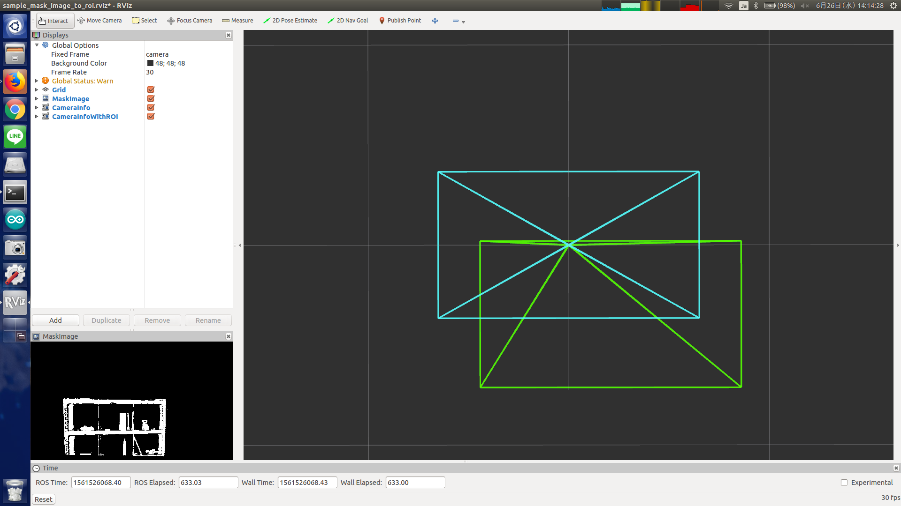

# MaskImageToROI



Convert a mask image into camera info with roi.

## Subscribing Topic
* `~input` (`sensor_msgs/Image`)

  Input mask image.

* `~input/camera_info` (`sensor_msgs/CameraInfo`)

  Original camera info.


## Publishing Topic
* `~output` (`sensor_msgs/CameraInfo`)

  Camera info with ROI field filled.


## Sample

```bash
roslaunch jsk_perception sample_mask_image_to_roi.launch
```
