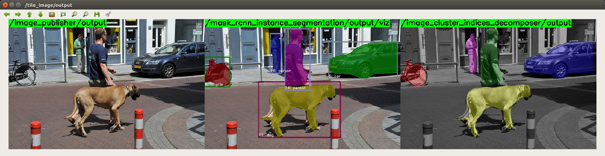

mask_rcnn_instance_segmentation.py
==================================

What is this?
-------------

Predict object instance masks and labels.

Subscribing Topic
-----------------

* ``~input`` (``sensor_msgs/Image``)

  Raw image.

Publishing Topic
----------------

* ``~output/cluter_indices`` (``jsk_recognition_msgs/ClusterPointIndices``)

  Image indices of each instance.

* ``~output/labels`` (``jsk_recognition_msgs/LabelArray``)

  Class labels of each instance.

* ``~output/viz`` (``sensor_msgs/Image``)

  Visualized image of recognition result.

Parameters
----------

* ``~gpu`` (Int, default: ``0``)

  GPU id.

* ``~fg_class_names`` (List of String, required)

  Foreground class names that is used to identify number of class.
  It is also used for the ``name`` field of ``~output/labels``.

* ``~pretrained_model`` (String, required)

  Pretrained model path.

Sample
------

.. code-block:: bash

  roslaunch jsk_perception sample_mask_rcnn_instance_segmentation.launch gpu:=0
