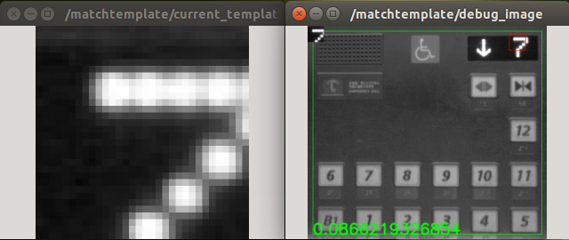

matchtemplate.py
================

What is this?
-------------

Run image template matching and publish the position of matched image.

Subscribing Topic
-----------------

* ``reference`` (``sensor_msgs/Image``)

  Input reference image.

* ``search`` (``sensor_msgs/Image``)

  Input image to detect if part of which matches the ``reference``.

* ``set_reference_point`` (``geometry_msgs/PointStamped``)

  Center point of reference window in ``reference`` image.

* ``set_search_rect`` (``jsk_recognition_msgs/Rect``)

  Searched window rectangle in ``search`` image.

  Please set this to top left point, width and height.

Publishing Topic
----------------

* ``current_template`` (``sensor_msgs/Image``)

  Template image cropped from ``reference``.

* ``result`` (``geometry_msgs/TransformStamped``)

  Pixel index of the center point of matched rectangle.

* ``debug_image`` (``sensor_msgs/Image``)

  Visualization of matching result.

  This topic is published only when ``~show_debug_image`` is set to true.

Parameters
----------

* ``~current_template_id`` (String, default: ``''``)

  Not used now.

* ``~match_method`` (Int, default: ``1``)

  Choose from ``TM_SQDIFF (0)``, ``TM_SQDIFF_NORMED (1)``, ``TM_CCORR (2)``, ``TM_CCORR_NORMED (3)``, ``TM_CCOEFF (4)`` and ``TM_CCOEFF_NORMED (5)``.

* ``~template_color_space`` (String, default: ``mono8``)

  Choose from ``mono8``, ``bgr8``, ``bgra8``, ``hsv8`` and ``hsva8``.

* ``~show_debug_image`` (Bool, default: ``True``)

  Publish ``debug_image`` if true.

* ``~auto_search_area`` (Bool, default: ``True``)

  Enable feedback of searching status if true.

* ``~default_template_width`` (Int, default: ``32``)

  Allowed value: 0 <= width <= 128.

* ``~default_template_height`` (Int, default: ``32``)

  Allowed value:  0 <= height <= 128.

* ``~default_search_width`` (Int, default: ``64``)

  Allowed value: 0 <= width <= 256.

* ``~default_search_height`` (Int, default: ``64``)

  Allowed value: 0 <= height <= 256.

Sample
------

.. code-block:: bash

  roslaunch jsk_perception sample_matchtemplate.launch
