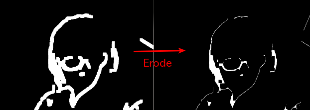
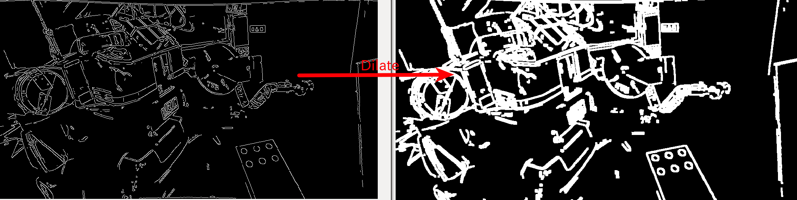
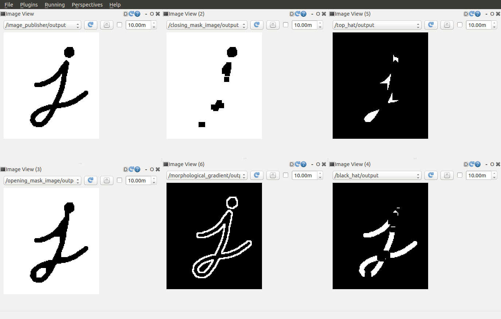
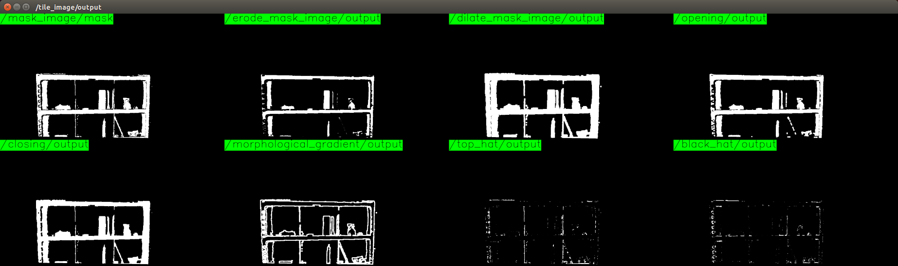

# MorphologicalOperator (DilateMaskImage, Closing etc.)





Apply morphological transformations.

## Nodes

* `dilate_mask_image`
* `erode_mask_image`
* `opening`
* `closing`
* `morphological_gradient`
* `top_hat`
* `black_hat`

## Nodelets

* `jsk_perception/DilateMaskImage`
* `jsk_perception/ErodeMaskImage`
* `jsk_perception/Opening`
* `jsk_perception/Closing`
* `jsk_perception/MorphologicalGradient`
* `jsk_perception/TopHat`
* `jsk_perception/BlackHat`

## Subscribing Topic
* `~input` (`sensor_msgs/Image`)

  Input image

## Publishing Topic
* `~output` (`sensor_msgs/Image`)

  Output transformed image.

## Parameters
* `~method` (`0`, `1` or `2`, default: `0`)

  Method to transform image.

  `0` means rectangular box model, `1` means cross model and `2` means ellipse.

* `~size` (Integer, default: `1`)

  Kernel size to transform.

* `~iterations` (Integer, default: `1`)

  Iterations of transforming image.

## Sample

```bash
roslaunch jsk_perception sample_morphological_operator.launch
```
