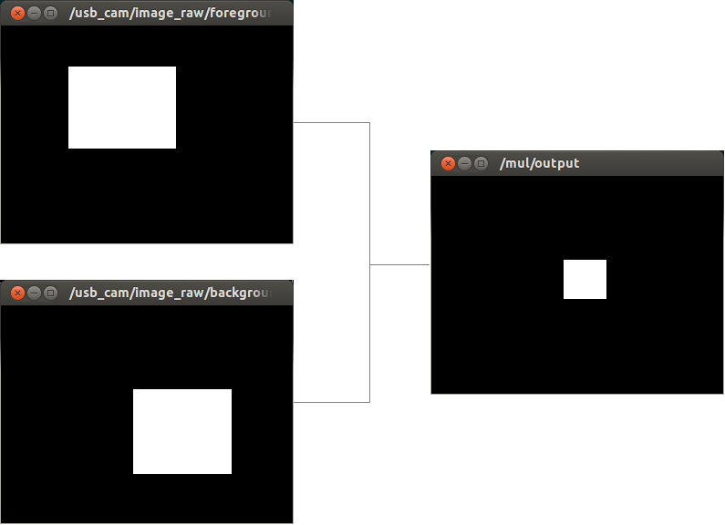

# MultiplyMaskImage


Multiply (bitwise) two mask image into one mask image.

## Subscribing Topic
* `~input/src1` (`sensor_msgs/Image`)
* `~input/src2` (`sensor_msgs/Image`)

  Input mask images.
## Publishing Topic
* `~output` (`sensor_msgs/Image`)

  Added mask image.
## Parameters
* `~approximate_sync` (Bool, default: `false`)

  Approximately synchronize `~input/src1` and `~input/src2` if it's true.

* ``~queue_size`` (Int, default: ``100``)

  How many messages you allow about the subscriber to keep in the queue.
  This should be big when there is much difference about delay between two topics.

## Sample

```bash
roslaunch jsk_perception sample_multiply_mask_image.launch
```
