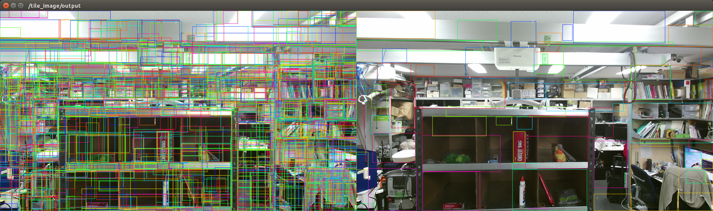

# non_maximum_suppression.py



## What is this?

Regard highly overlapped rectangles in an image as the same object and remove extra rectangles.


## Subscribing Topic

* `~input` (`jsk_recognition_msgs/RectArray`)

  Input rectangles.


## Publishing Topic

* `~output` (`jsk_recognition_msgs/RectArray`)

  Thinned out rectangles.

* `~output/count` (`std_msgs/Int64`)

  Number of output rectangles.


## Parameters

* `~threshold` (Float, default: `0.0`)

  Maximum allowed value of IoU (intersect over union) for each pair of input rectangles.


## Advertising Service

* `non_maximum_suppression` (`jsk_perception/NonMaximumSuppresion`)

  Service API of non-maximum suppression described above.


## Sample

```bash
roslaunch jsk_perception sample_non_maximum_suppression.launch
```
