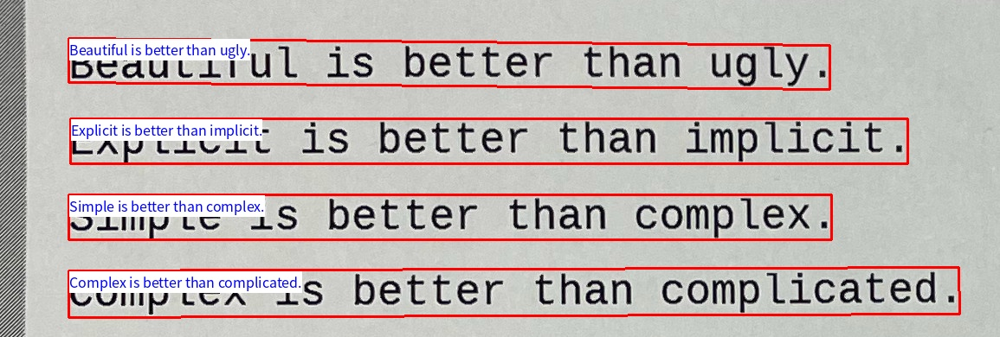

ocr_node.py
===========

What is this?
-------------

Optical Character Reader (OCR) node from image and text area.
We recommend the python3 environment.
For python2 users, please do pip install ``pytesseract==0.3.1`` manually because the latest version of pytesseract is not installed automatically.

Subscribing Topic
-----------------

* ``~input`` (``sensor_msgs/Image``)

  Raw image.

* ``~input/polygons`` (``jsk_recognition_msgs/PolygonArray``)

  Polygon array representing a text area.
  If ``~subscribe_polygon`` is ``True``, subscribe ``~input/polygons``.

* ``~input/rects`` (``jsk_recognition_msgs/RectArray``)

  Rect array representing a text area.
  If ``~subscribe_polygon`` is ``False``, subscribe ``~input/rects``.

Publishing Topic
----------------

* ``~output`` (``std_msgs/String``)

  Recognized text.

* ``~output/viz`` (``sensor_msgs/Image``)

  Visuzalized OCR results.

* ``~output/labels`` (``jsk_recognition_msgs/LabelArray``)

  The recognized text is output as the label name in the order of the input polygon array or rect array.

* ``~output/debug/viz`` (``sensor_msgs/Image``)

  Tile image of cropped input image.

* ``~output/debug/binary_viz`` (``sensor_msgs/Image``)

  Tile image of a binarized cropped input image.

Parameters
----------

* ``~approximate_sync`` (Bool, default: ``False``)

  Whether to use approximate for input topics.

* ``~queue_size`` (Int, default: ``100``)

  How many messages you allow about the subscriber to keep in the queue.
  This should be big when there is much difference about delay between two topics.

* ``~slop`` (Double, Default: ``0.1``)

  Slop for approximate sync.

* ``~language`` (Int, Default: ``eng``)

  OCR target language.
  In current ``ocr_node.py`` uses ``tesseract-ocr``.

  If you want to use a language other than English,
  please install the appropriate language data from `packages <https://packages.ubuntu.com/search?lang=en&suite=impish&searchon=names&keywords=tesseract>`_ and change the ``language`` argument.

  For example, if you want to use Japanese,
  please install ``tesseract-ocr-jpn`` (``apt install tesseract-ocr-jpn`` in ``Ubuntu``) and pass ``jpn`` as the ``language`` argument.

* ``~number_of_jobs`` (Int, Default: ``-1``)

  Number of jobs for ocr. If this value is ``-1``,
  use the value of ``multiprocessing.cpu_count()``.

* ``~font_path`` (String, default: ``""``)

  Font path.
  Specify the font with the characters you want to display.

* ``~font_size`` (Int, default: ``16``)

  Font size for visualization

* ``~box_thickness`` (Int, default: ``2``)

  Thickness of bounding box (text areas).

* ``~resolution_factor`` (Double, default: ``2.0``)

  Factor for resolution of output image.
  When this option is set as ``1.0``, an output image has the same resolution as an input image.

* ``~interpolation_method`` (Enum[Int], default: ``INTER_LANCZOS4``)

  Method for interpolation on input image resizing.

* ``~subscribe_polygon`` (Bool, Default: ``False``)

  If ``~subscribe_polygon`` is ``True``, subscribe ``~input/polygons``.
  If ``~subscribe_polygon`` is ``False``, subscribe ``~input/rects``.

Sample
------

.. code-block:: bash

  roslaunch jsk_perception sample_craft_node.launch
