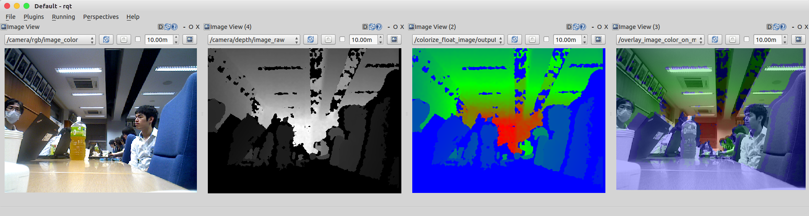

OverlayImageColorOnMono
=======================

What is this?
-------------

Publish the overlayed image of input color image on input mono image.

Subscribing Topic
-----------------

* ``~input/color`` (``sensor_msgs/Image``)

  Raw image that is overlayed as color image.

* ``~input/mono`` (``sensor_msgs/Image``)

  Raw image that converted to mono image and being overlayed by the color image.

Publishing Topic
----------------

* ``~output`` (``sensor_msgs/Image``)

  Overlayed image of input color image on input mono image.

Parameters
----------

* ``~color_alpha`` (Double, default: ``0.3``)

  The weight for pixel value of color image.

* ``~approximate_sync`` (Bool, default: ``False``)

  Whether to use approximate for input topics.

* ``~queue_size`` (Int, default: ``100``)

  How many messages you allow about the subscriber to keep in the queue.
  This should be big when there is much difference about delay between two topics.

Sample
------

.. code-block:: bash

  roslaunch jsk_perception sample_overlay_image_color_on_mono.launch
