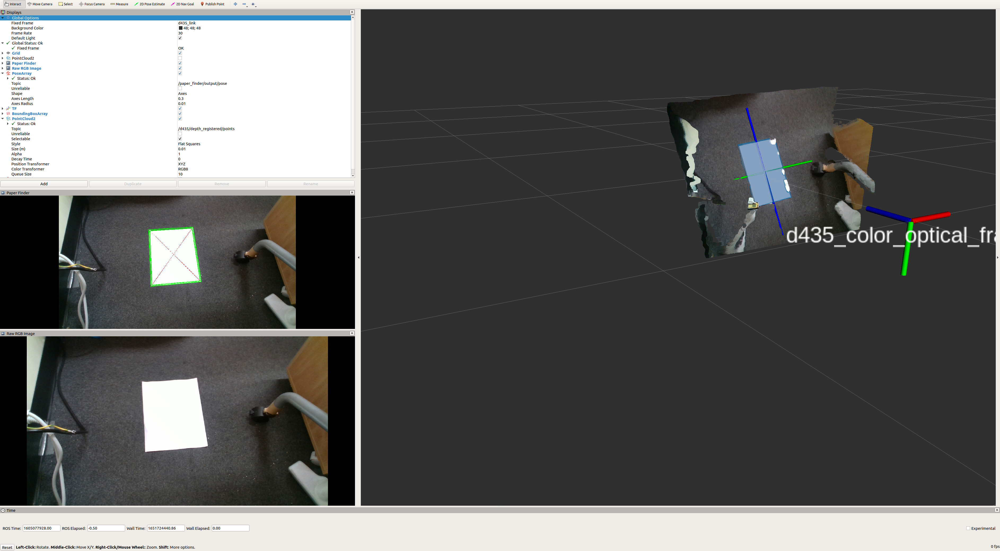

# paper_finder



  Detect papers (rectangle) and publish posearray.

## Subscribing Topic

- `~input` (`sensor_msgs/Image`)

  Input image. 

- `~input/depth` (`sensor_msgs/Image`)

  Input depth image.

- `~input/camera_info` (`sensor_msgs/CameraInfo`)

  Camera info.

## Publishing Topics

- `~output/viz` (`sensor_msgs/Image`)

  Output image. 

- `~output/pose` (`geometry_msgs/PoseArray`)

  Output pose. 

## Parameters

- `~angle_tolerance` (float default: 286.4788975654116) 286.4788975654116 = np.rad2deg(5.0)
- `~area_tolerance` (float default: 0.1)
- `~rect_x` (float default: 0.210)
- `~rect_y` (float default: 0.297)
- `~length_tolerance` (float default: 0.04)
- `~queue_size` (int default: 10)
- `~with_depth` (bool default: True)
- `~approximate_sync` (bool default: True)
- `~slop` (float default: 0.1)

## Sample

```
roslaunch jsk_perception sample_paper_finder.launch 
```
