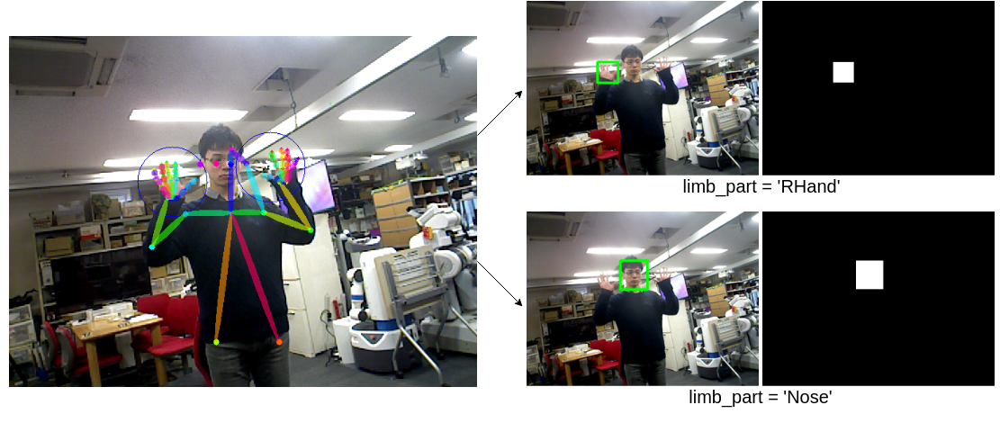

people_mask_publisher.py
========================

What is this?
-------------

Create people mask image according to people pose information.

Subscribing Topic
-----------------

* ``~input`` (``sensor_msgs/Image``)

  Input image.

* ``~input/pose`` (``jsk_recognition_msgs/PeoplePoseArray``)

  Input people pose array.

Publishing Topic
----------------

* ``~output`` (``sensor_msgs/Image``)

  People mask image.

* ``~debug/output`` (``sensor_msgs/Image``)

  Debug image which has visualized rectangle of the masked limb part.

Parameters
----------

* ``~person_indices`` (Int, Default: ``-1``)

  Which person to create mask of. ``-1`` represents creating masks of all people.

* ``~limb_part`` (String or List of String, Default: ``all``)

  Which limb part to create mask of.

  ``RHand``, ``LHand``, ``Nose`` and ``all`` is allowed.

* ``~arms_score_threshold`` (Float, Default: ``0.25``)

  Threshold of arm score.

  Used when ``limb_part`` includes ``RHand`` or ``LHand``.

* ``~hand_ratio`` (Float, Default: ``0.33``)

  Ratio that is used to predict hand position from elbow and wrist positions.

  Used when ``limb_part`` includes ``RHand`` or ``LHand``.

* ``~hand_width_ratio`` (Float, Default: ``0.8``)

  Ratio that is used to predict hand region from arm length.

  Used when ``limb_part`` includes ``RHand`` or ``LHand``.

* ``~face_ratio`` (Float, Default: ``0.6``)

  Ratio that is used to predict face position from nose and neck positions.

  Used when ``limb_part`` includes ``Nose``.

* ``~face_shoulder_ratio`` (Float, Default: ``0.5``)

  Ratio that is used to predict face position from shoulder positions.

  Used when ``limb_part`` includes ``Nose``.

* ``face_width_margin_ratio`` (Float, Default: ``1.3``)

  Ratio that is used to decide face width margin.

  Used when ``limb_part`` includes ``Nose``.

* ``~approximate_sync`` (Bool, Default: ``False``)

  Use approximate synchronization policy.

* ``~queue_size`` (Int, Default: ``10``)

  Queue size for synchronization.

* ``~slop`` (Float, Default: ``0.1``)

  Slop for approximate sync.

Example
-------

.. code-block:: bash

   roslaunch jsk_perception sample_people_pose_estimation_2d.launch GPU:=0 LIMB_PART:='RHand'
   roslaunch jsk_perception sample_people_pose_estimation_2d.launch GPU:=0 LIMB_PART:='Nose'
