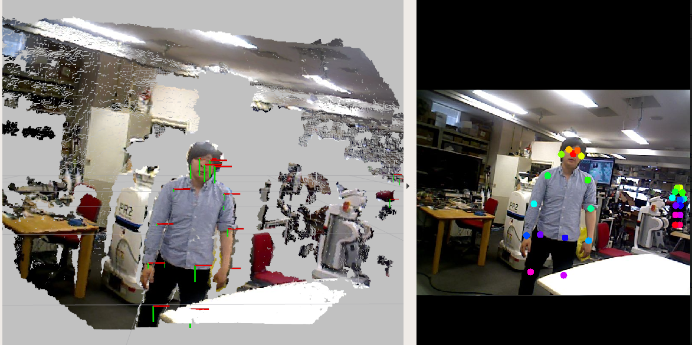

# people\_pose\_2d\_to\_3d.py



Convert 3D human pose from 2D human pose with depth image

## Subscribing Topic

* `~input/pose` (`jsk_recogniton_msgs/PeoplePoseArray`)

  Input 2D human pose

* `~input/depth` (`sensor_msgs/Image`)

  Input depth image

* `~input/info` (`sensor_msgs/CameraInfo`)

  Input depth camera info

## Publishing Topic

* `~output/pose` (`jsk_recogniton_msgs/PeoplePoseArray`)

  Output 3D human pose

## Parameters

* `~sync_camera_info` (`Bool`, default: `false`)

  Synchronize `~input/info` topic with other topics or not.

  If this is `false`, `~input/info` is stored and reused.

* `~approximate_sync` (`Bool`, default: `true`)

  Approximately synchronize input topics or not

* `~queue_size` (`Int`, default: `10`)

  Queue size for message filters

* `~slop` (`Float`, default: `0.1`)

  Slop size for approximate synchronize

## Sample

```bash
roslaunch jsk_perception sample_people_pose_estimation.launch
```
