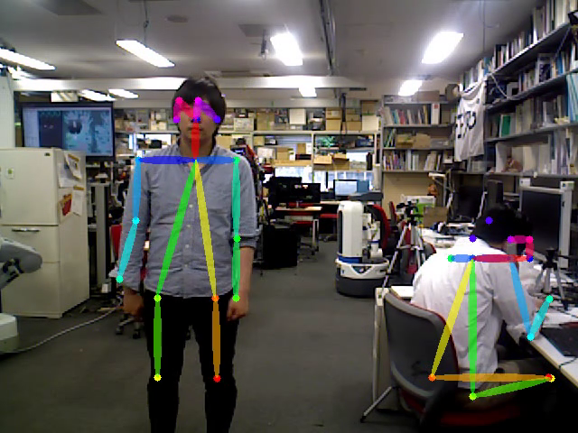

people_pose_estimation_2d.py
============================

What is this?
-------------

Estimate people pose and hand pose in 2d.
Please refer to `original paper <https://arxiv.org/abs/1611.08050>`_.

In order to use this feature, you need to install `chainer <https://github.com/chainer/chainer>`_.
To install chainer with GPU support, please refer to `this page <../../install_chainer_gpu.html>`_.

Subscribing Topic
-----------------

* ``~input`` (``sensor_msgs/Image``)

  Input image.

* ``~input/depth`` (``sensor_msgs/Image``)

  Input depth image.

* ``~input/info`` (``sensor_msgs/CameraInfo``)

  Input camera info.

Publishing Topic
----------------

* ``~output`` (``sensor_msgs/Image``)

  Detected people pose image.

* ``~pose`` (``jsk_recognition_msgs/PeoplePoseArray``)

  If ``with_depth`` is true, publish 3D joint position.

  If ``with_depth`` is false, publish 2D joint position in image.

* ``~pose2d`` (``jsk_recognition_msgs/PeoplePoseArray``)

  If ``with_depth`` is true, publish 2D joint position.

* ``~skeleton`` (``jsk_recognition_msgs/HumanSkeletonArray``)

  If ``with_depth`` is ``true``, publish 3D human skeletons.

  Rviz visualization is available in `jsk-ros-pkg/jsk_visualization #740 <https://github.com/jsk-ros-pkg/jsk_visualization/pull/740>`_.

Parameters
----------

* ``~gpu`` (Int, Default: ``-1``)

  GPU id. ``-1`` represents CPU mode.

* ``~scales`` (Float, Default: ``0.38``)

  Resize image scale.

* ``~stride`` (Int, Default: ``8``)

  Stride of image.

* ``~pad_value`` (Int, Default: ``128``)

  Value of padding area.

* ``~thre1`` (Float, Default: ``0.1``)

  Threshold of heatmap value.

* ``~thre2`` (Float, Default: ``0.05``)

  Threshold of score.

* ``~hand/enable`` (Bool, Default: ``False``)

  If ``True``, estimate hand pose.

* ``~hand/gaussian_ksize`` (Int, Default: ``17``)

  Size of gaussian kernel.

* ``~hand/gaussian_sigma`` (Float, Default: ``2.5``)

  Value of gaussian sigma.

* ``~hand/thre1`` (Float, Default: ``20``)

  Threshold of width of hand area.

* ``~hand/thre2`` (Float, Default: ``0.1``)

  Threshold of hand score.

* ``~hand/width_offset`` (Int, Default: ``0``)

  Offset of hand area's width.

* ``~visualize`` (Bool, Default: ``True``)

  If ``~visualize`` is true, draw an estimated pose.

* ``~model_file`` (String, Required)

  Trained model file.

* ``~with_depth`` (Bool, Default: ``False``)

  If true, subscribe ``~input/depth`` and ``~input/info``.

* ``~sync_camera_info`` (Bool, Default: ``False``)

  Synchronize ``~input/info`` if enabled, otherwise the last received camera info message is used.

* ``~approximate_sync`` (Bool, Default: ``True``)

  Use approximate synchronization policy.

* ``~queue_size`` (Int, Default: ``10``)

  Queue size for synchronization.

* ``~slop`` (Float, Default: ``0.1``)

  Slop for approximate sync.

Example
-------

.. code-block:: bash

   roslaunch jsk_perception sample_people_pose_estimation_2d.launch gpu:=0
