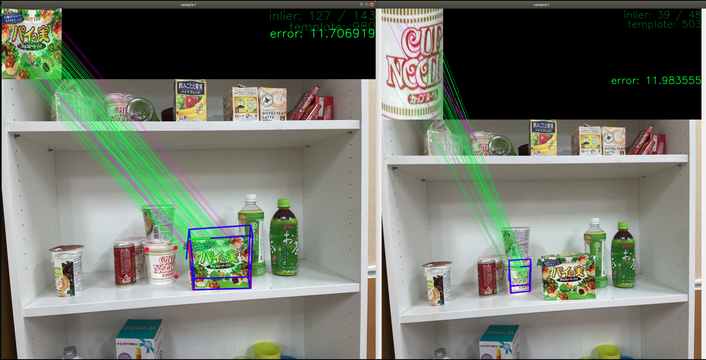

# PointPoseExtractor


  Calcute object pose compared to template. 

## Subscribing Topic

- `/ImageFeature0D` (`posedetection_msgs::ImageFeature0D`)

  Image, camera and template feature information.
  You can use [ImageShift](https://jsk-docs.readthedocs.io/projects/jsk_recognition/en/latest/imagesift/nodes/imagesift.html) to get it.

## Publishing Topics

- `/ObjectDetection` (`posedetection_msgs::ObjectDetection`)

  Detected object pose with time stamp. 

- `/ObjectDetection_agg` (`posedetection_msgs::ObjectDetection`)

  Detected object pose with time stamp. 

- `/object_pose` (`geometry_msgs::PoseStamped`)

  Detected Object Pose. 

- `~debug_image` (`cv_bridge::CvImage`) 

  Output image for debug.

- `/tf` (`tf2_msgs/TFMessage`)

  Detected Object Frame when `~publish_tf` is set to true.

## Parameters

- `~template_filename` (str default: `"/sample/opencv-logo2.png"`)

  path to template image

- `~object_width` (float default: `0.06`)

  Width of template image
  
- `~object_height` (float default: `0.0739`)

  Height of template image

- `~relative_pose` (str default: `"0 0 0 0 0 0 1"`)

  Coordinate of the object relative to the texture
  
- `~reprojection_threshold` (float default: `3.0`)
- `~distanceratio_threshold` (float default: `0.49`)
- `~error_threshold` (float default: `50.0`)
- `~theta_step` (float default: `5.0`)
- `~phi_step` (float default: `5.0`)
- `~viewer_window` (bool default: `true`)
- `~window_name` (str default: `"sample1"`)
- `~autosize` (bool default: `false`)

  The window size is automatically adjusted to fit the displayed image, and you cannot change the window size manually.

- `~publish_null_object_detection` (bool default: `false`)
- `~publish_tf` (bool defaut: `false`)

  If set to true, detected object pose is also broadcasted as tf frame.

- `~child_frame_id` (string default: `"matching"`)

  frame_id of detected object when `~publish_tf` is set to true.

## Service 

- `/SetTemplate` (`SetTemplate`)

  Used to add another template.

## Mouse Event



  Set template from viewer window.

  To specify the range of template, left-click four corners clockwise from upper left. Selected points are reset by right-clicking.

  After all four points are selected, you can input template's width, height and filename. The filename should have an extention.
  
## Sample

`sample_point_pose_extractor.launch`

```
roslaunch jsk_perception sample_point_pose_extractor.launch
rostopic echo /ObjectDetection
```

### Example of how to run set_template service 

  `client.call` is available only after the node receives `ImageFeature0D`.

```
#!/usr/bin/env python
# -*- coding: utf-8 -*-

import cv2

import cv_bridge
import rospy
from jsk_perception.srv import SetTemplate, SetTemplateRequest

rospy.init_node('point_pose_extractor_sample')

client = rospy.ServiceProxy('SetTemplate', SetTemplate)
rospy.sleep(1)

req= SetTemplateRequest()

im = cv2.imread('../../sample/ros_diamondback.jpg')
bridge = cv_bridge.CvBridge()
imgmsg = bridge.cv2_to_imgmsg(im, encoding='bgr8')
imgmsg.header.frame_id = 'dummy_camera'
imgmsg.header.stamp = rospy.Time.now()

req.type = 'img0001'
req.image = imgmsg
req.dimx = 0.1
req.dimy = 0.05
req.savefilename = 'img0001.png'
res = client.call(req)
print(res)
```
