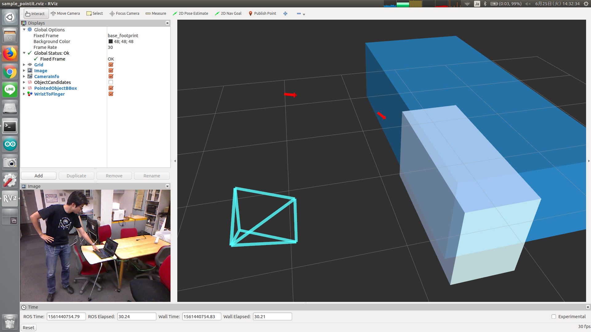

# pointit.py



Select object bounding box by human pointing his/her finger toward one of them.

## Subscribing Topics

* `~input` (`jsk_recognition_msgs/PeoplePoseArray`)

  Pose of human pointing his/her finger toward some objects.

* `~input/boxes` (`jsk_recogntion_msgs/BoundingBoxArray`)

  Object bounding boxes.

* `~input/class` (`jsk_recognition_msgs/ClassificationResult`)

  Label of objects.

  This topic is subscribed only when `~use_classfication_result` is True.


## Publishing Topics

* `~output` (`jsk_recognition_msgs/BoundingBoxArray`)

  Pointed object bounding box.

* `~output/marker_array` (`visualization_msgs/MarkerArray`)

  Finger marker.


## Parameters

* `~use_classfication_result` (Bool, default: `False`)

  If True, this node will subscribe `~input/class`.

  Also, parameter `~approximate_sync` and `~queue_size` will be enabled.

* `~approximate_sync` (Bool, default: `True`)

  Allow approximate synchronization of `~input/boxes` and `~input/class`.

* `~queue_size` (Int, default: `10` (when `~approximate_sync` is True) or `100` (when `~approximate_sync` is False))

  Maximum number of messages stored into subscriber for synchronization.

* `~slop` (Float, default: `0.1`)

  Maximum allowed time for approximate synchronization in [sec].

  This parameter is enabled only when `~approximate_sync` is True.

* `~min_dist_threshold` (Float, default: `0.0`)

  Minimum allowed distance from left/right hand to the nearest object.

* `~max_dist_threshold` (Float, default: `0.1`)

  Maximum allowed distance from left/right hand to the nearest object.

* `~min_norm_threshold` (Float, default: `0.2`)

  Minimum allowed distance from left/right finger to object candidates.

* `~use_tf2_buffer_client` (Bool, default: `True`)

  Whether to use `tf2_ros.BufferClient` or not.

  If false, `tf2_ros.Buffer` and `tf2_ros.TransformListener` will be used.


## Sample

```bash
roslaunch jsk_perception sample_pointit.launch
```
