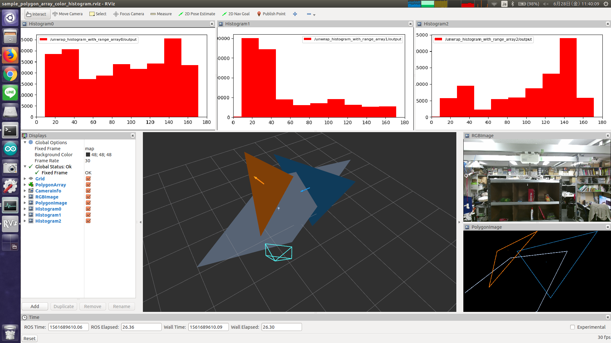

# PolygonArrayColorHistogram



Compute color histogram of the region which is specified by 3-D Polygon.

## Subscribing Topics
* `~input` (`jsk_recognition_msgs/PolygonArray`)

  Input 3-D polygon array.

* `~input/image` (`sensor_msgs/Image`)

  Input image.

* `~input/info` (`sensor_msgs/CameraInfo`)

  Input camera info.

## Publishing Topics
* `~output` (`jsk_recognition_msgs/HistogramWithRangeArray`)

  Histogram array. The order of the array is the same as `~input` polygon array.

* `~debug/polygon_image` (`sensor_msgs/Image`)

  Debug image representing polygons seen from camera.


## Parameter
* `~bin_size` (Int, default: `10`)

  The number of histogram bins.

* `~pixel_min_value` (Int, default: `0`)
* `~pixel_max_value` (Int, default: `180`)

  Minimum and maximum value of the histogram.

* `~debug_line_width` (Int, default: `2`)

  Line width of debug image.

* `~max_queue_size` (Int, default: `10`)

  Queue size of subscriber

* `~synchronizer_queue_size` (Int, default: `100`)

  Queue size of message filter


## Sample

```bash
roslaunch jsk_perception sample_polygon_array_color_histogram.launch
```
