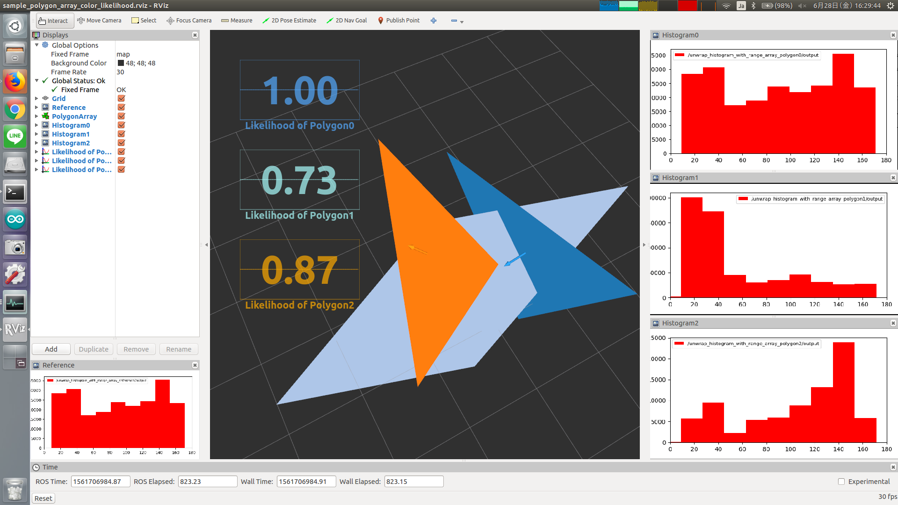

# PolygonArrayColorLikelihood



Compute polygon likelihood based on distance of histograms.

## Subscribing Topics
* `~input/polygons` (`jsk_recognition_msgs/PolygonArray`)

  Input polygons.

* `~input/histograms` (`jsk_recognition_msgs/HistogramWithRangeArray`)

  Color histogram of input polygons.

* `~input/reference` (`jsk_recognition_msgs/HistogramWithRange`)

  Reference color histogram.


## Publishing Topics
* `~output` (`jsk_recognition_msgs/PolygonArray`)

  Output polygons with updated likelihood field.


## Parameters
* `~approximate_sync` (Bool, default: `false`)

  Approximately synchronize `~input/polygons` and `~input/histograms`.

* `~max_queue_size` (Int, default: `10`)

  Queue size of subscriber

* `~synchronizer_queue_size` (Int, default: `100`)

  Queue size of message filter

* `~reference_file` (String, default: `""`)

  If this parameter is specified, `PolygonArrayColorLikelihood` reads reference histogram from
  a yaml file instead of subscribing `~input/reference`.

  The yaml file format is
  ```yaml
  bins:
  - 
    min_value: xx
    max_value: xx
    count: xx
  - 
    min_value: xx
    max_value: xx
    count: xx
  ```

* `~coefficient_method` (Int, default: `0`)

  Method to compute coefficient between two histograms.

  Choose from `correlancy (0)`, `chi_squared (1)`, `intersect (2)`,
  `bhattacharyya (3)`, `EMD_Manhattan (4)` and `EMD_Euclid (5)`.

  This parameter can be changed by `dynamic_reconfigure`.


## Sample

```bash
roslaunch jsk_perception sample_polygon_array_color_likelihood.launch
```
