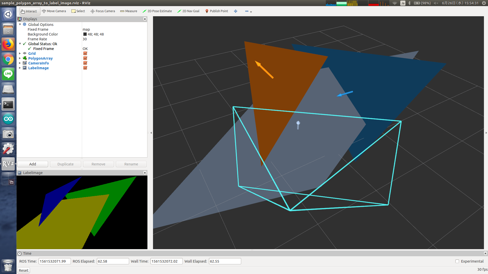

# PolygonArrayToLabelImage



Convert polygon array into label image. Label starts with 1 and 0 mean the pixel does not
belong to any polygons. No z-buffer is taken into account and occlusion is not solved correctly.

Frame ID of polygons and camera_info must be the same.


## Subscribing Topic
* `~input` (`jsk_recognition_msgs/PolygonArray`)

  Input 3-D polygon array.

* `~input/camera_info` (`sensor_msgs/CameraInfo`)

  Input camera info to project 3-D polygon.


## Publishing Topic
* `~output` (`sensor_msgs/Image`)

  Label image filled with `~input` polygons. Currently only convex polygon is supported.


## Sample

```bash
roslaunch jsk_perception sample_polygon_array_to_label_image.launch
```
