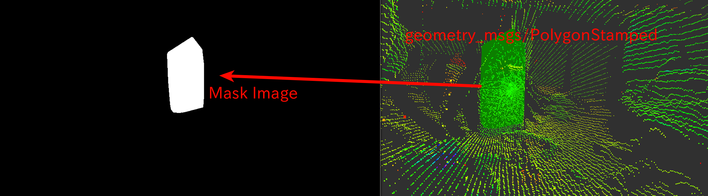

# PolygonToMaskImage


Convert polygon into mask image.

## Subscribing Topic
* `~input` (`geometry_msgs/PolygonStamped`)

  Input 3-D polygon.

* `~input/camera_info` (`sensor_msgs/CameraInfo`)

  Input camera info to project 3-D polygon.

  frame_id of `~input` and `~input/camera_info` should be the same.

## Publishing Topic
* `~output` (`sensor_msgs/Image`)

  Mask image filled with `~input` polygon. Currently only convex polygon is supported.


## Sample

```bash
roslaunch jsk_perception sample_polygon_to_mask_image.launch
```
