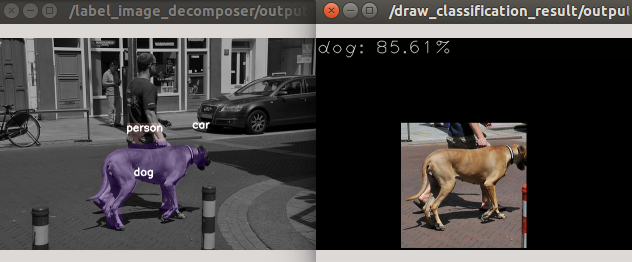

probability_image_classifier.py
===============================

What is this?
-------------

Classify from probability image.

Return label whose sum of probability is largest.

Subscribing Topic
-----------------

* ``~input`` (``sensor_msgs/Image``)

  Input probability image.

Publishing Topic
----------------

* ``~output`` (``jsk_recognition_msgs/ClassificationResult``)

  Classification result of input image.

Parameters
----------

* ``~ignore_labels`` (List of Int, Default: ``[]``)

  Ignoring labels.

Example
-------

.. code-block:: bash

   roslaunch jsk_perception sample_probability_image_classifier.launch
