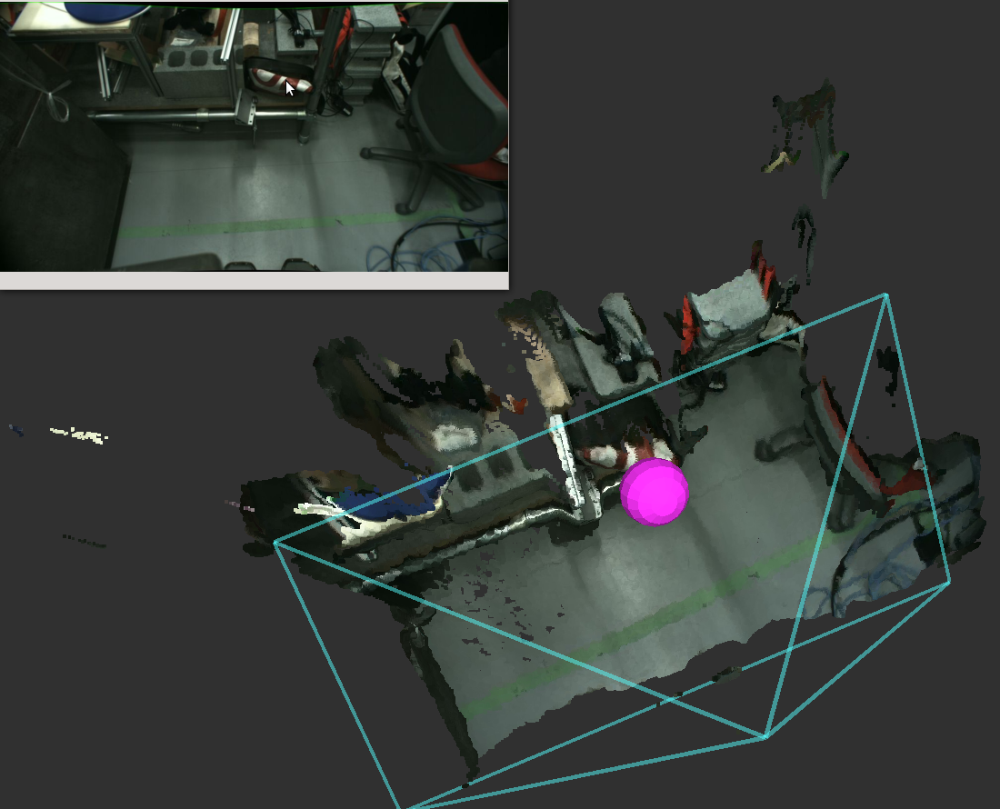

# ProjectImagePoint


Convert image local coordinates (represented as `geomery_msgs/PointStamped`) into 3-D point.
Z value of the point is specified via dyanmci_reconfigure API.

## Subscribing Topic
* `~input` (`geometry_msgs/PointStamped`)

  Input point in image local coordinates.

* `~input/camera_info` (`sensor_msgs/CameraInfo`)

  Camera parameter of the original image.


## Publishing Topic
* `~output` (`geometry_msgs/PointStamped`)

  Output point and the value is scaled to satisfy specified z value.

* `~output/ray` (`geometry_msgs/Vector3Stamped`)

  3-D ray vector of the point of image local coordinates.


## Parameters
* `~z` (Double, default: `2.0`)

  Z value of projected point.


## Sample

```bash
roslaunch jsk_perception sample_project_image_point.launch
```
