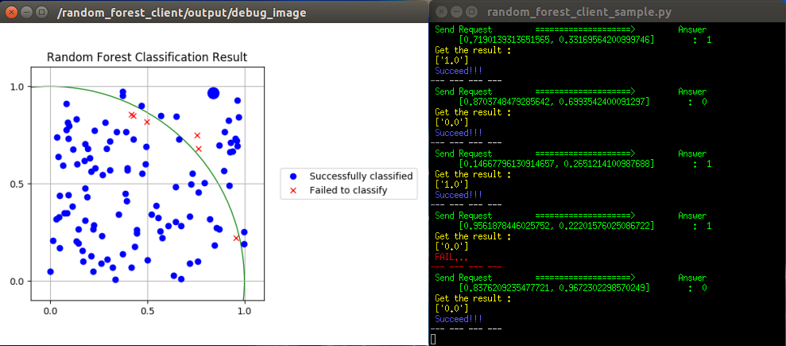

random_forest_server.py
=======================

What is this?
-------------

Service server of Random Forest classifier.

Advertising Service
-------------------

* ``predict`` (``ml_classifiers/ClassifyData``)

  Returns classification result as a list of string, according to requested points.

  Currently, only ``ClassifyData/data/point`` field is used for request.

Parameters
----------

* ``~random_forest_train_file`` (String, required)

  Path to training data file used for building forest of tree.

  If the file name ends with 'pkl', then this node will treat it as a built forest and try to deserialize it.

  If not, the file should contain training data as a list of float in each line.

* ``~random_forest_train_class_file`` (String)

  When ``~random_forest_train_file`` does not end with 'pkl', this parameter will be enabled.

  The file should contain ground-truth class label data as a float number in each line.

Sample
------

.. code-block:: bash

  roslaunch jsk_perception random_forest_sample.launch
