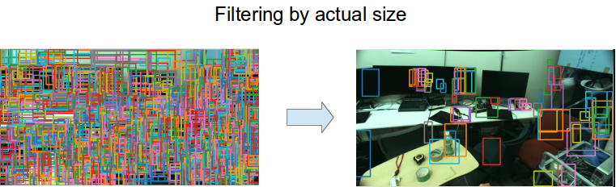

# RectArrayActualSizeFilter


Filter `jsk_recognition_msgs/RectArray` with actual size based on depth image.

Sample is `selective_search_depth_image_filter.launch`.

## Subscribing Topics
* `~input` (`jsk_recognition_msgs/RectArray`)

  Input array of rectangle regions.
* `~input/depth_image` (`sensor_msgs/Image`)

  Input depth image.
* `~input/info` (`sensor_msgs/CameraInfo`)

  Intrinsic camera parameter of the depth image.

## Publishing Topics
* `~output` (`jsk_recognition_msgs/RectArray`)

  Filtered array of rectangle regions.

## Parameters
* `~approximate_sync` (bool, default: `False`)

  Synchronize timestamps of input topics approximately.
* `~kernel_size` (Integer, default: `3`)

  Kernel size to take average of distance.
* `~min_x`
* `~max_x`
* `~min_y`
* `~max_y`

  Minimum and maximum size of x (width) and y (height) axis in meter unit.

## Sample

```bash
roslaunch jsk_perception sample_rect_array_actual_size_filter.launch
```
