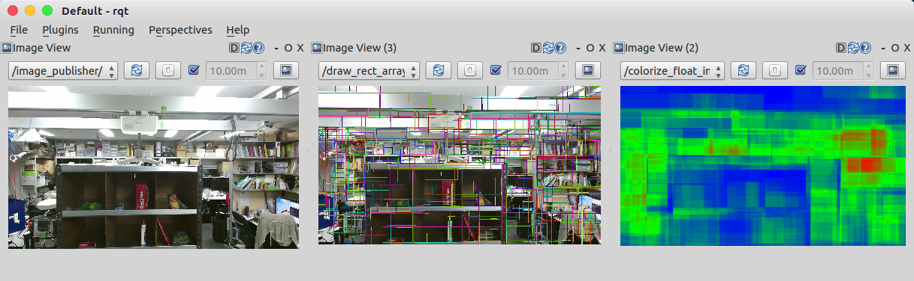

RectArrayToDensityImage
=======================

What is this?
-------------

Convert rect array (``jsk_recognition_msgs/RectArray``) to density image (``sensor_msgs/Image``, ``32FC1``).

Subscribing Topic
-----------------

* ``~input/image`` (``sensor_msgs/Image``)

  Raw image.

* ``~input/rect_array`` (``jsk_recognition_msgs/RectArray``)

  Array of rectangle.

Publishing Topic
----------------

* ``~output`` (``sensor_msgs/Image``, ``32FC1``)

  Density image computed based on the number of rectangles overlaid.

Parameters
----------

* ``~approximate_sync`` (Bool, default: ``False``)

  Whether to use approximate for input topics.

* ``~queue_size`` (Int, default: ``100``)

  How many messages you allow about the subscriber to keep in the queue.
  This should be big when there is much difference about delay between two topics.

Sample
------

.. code-block:: bash

  roslaunch jsk_perception sample_rect_array_to_density_image.launch

Test
----

.. code-block:: bash

  rostest jsk_perception rect_array_to_density_image.test
