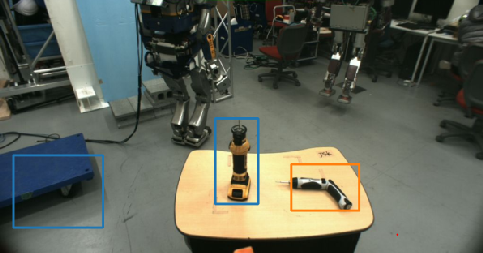

# rect_array_to_image_marker.py


Convert `jsk_recognition_msgs/RectArray` to `image_view2/ImageMarker`.

## Subscribing Topics
* `~input` (`jsk_recognition_msgs/RectArray`)

## Publishing Topics
* `~output` (`image_view2/ImageMarker`)

## Sample

```bash
roslaunch jsk_perception sample_rect_array_actual_size_filter.launch
```
