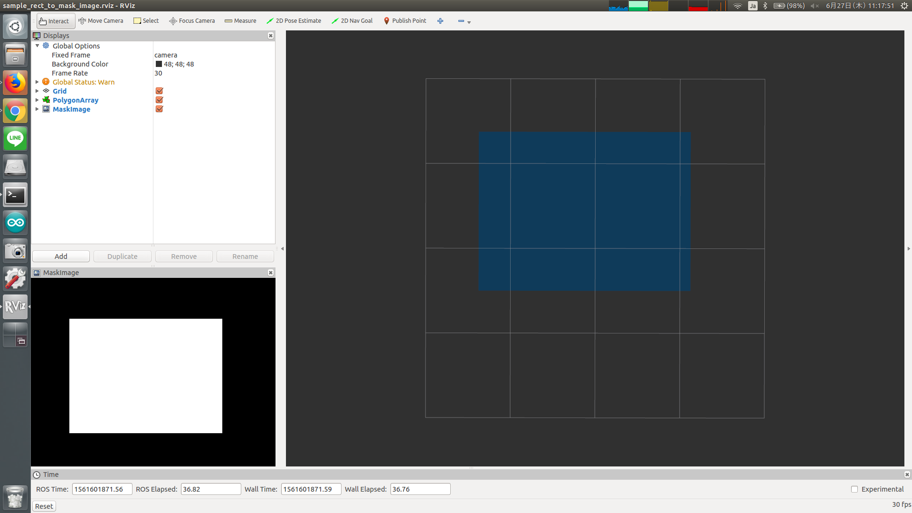

# RectToMaskImage



Convert 2D rectangle (`geometry_msgs/Polygon`), whose position and size are
represented in [pixel], into mask image (`sensor_msgs/Image`)

We expect it will be used with image_view2.


## Subscribing Topic
* `~input` (`geometry_msgs/PolygonStamped`)

  PolygonStamped to represent rectangle region of image.

* `~input/camera_info` (`sensor_msgs/CameraInfo`)

  Original camera info.


## Publishing Topic
* `~output` (`sensor_msgs/Image`)

  Mask image.


## Sample

```bash
roslaunch jsk_perception sample_rect_to_mask_image.launch
```
