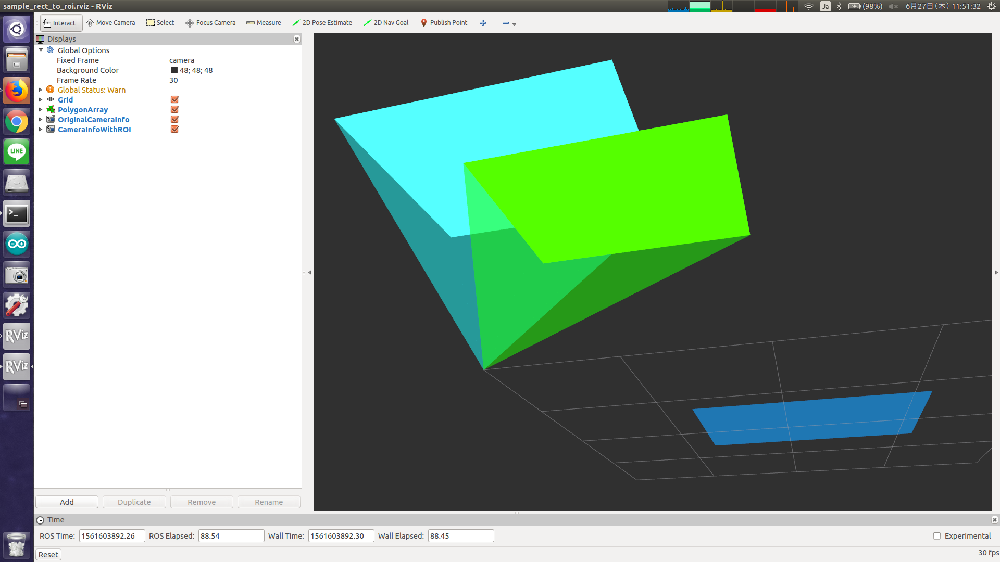

# RectToROI



Convert 2D rectangle (`geometry_msgs/Polygon`), whose position and size are
represented in [pixel], into camera info with ROI (`sensor_msgs/CameraInfo`).

We expect it will be used with image_view2.


## Subscribing Topic
* `~input` (`geometry_msgs/PolygonStamped`)

  Polygon to represent rectangle region of image.

* `~input/camera_info` (`sensor_msgs/CameraInfo`)

  Original camera info.


## Publishing Topic
* `~output` (`sensor_msgs/CameraInfo`)

  camera info with ROI filled by `~input`.


## Sample

```bash
roslaunch jsk_perception sample_rect_to_roi.launch
```
