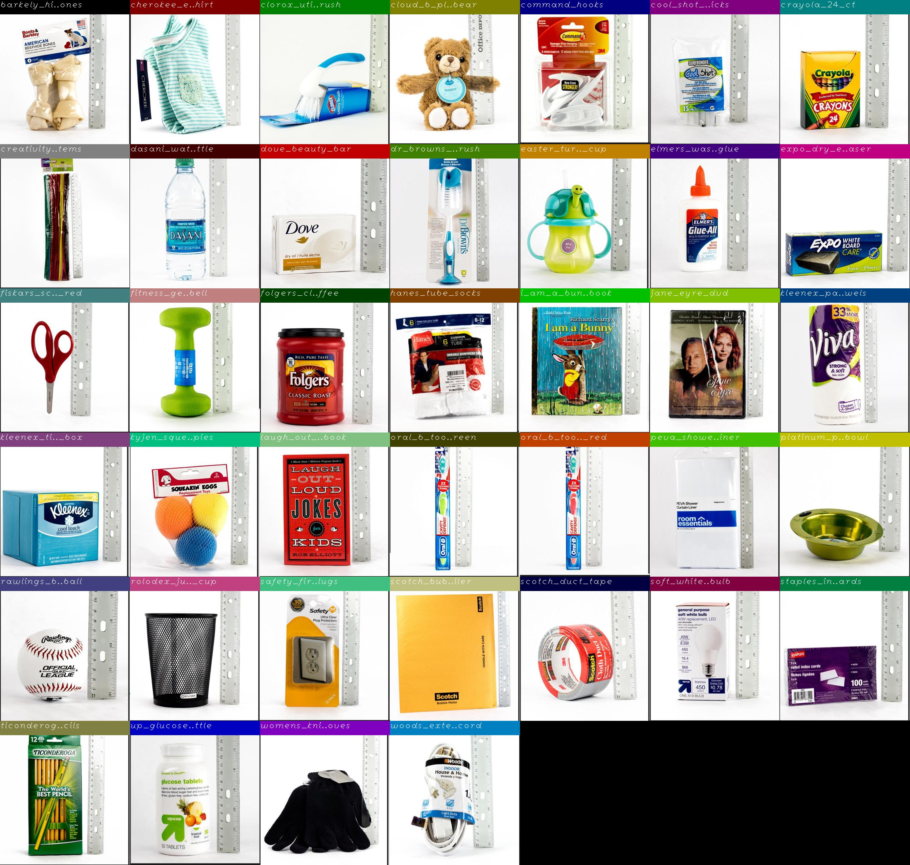

regional_feature_based_object_recognition.py
============================================

What is this?
-------------

Classify object image from input image and mask
using regional feature outputted by ResNet.

.. image:: images/regional_feature_based_object_recognition.gif
   :width: 80%

Subscribing Topic
-----------------

* ``~input`` (``sensor_msgs/Image``)

  Input label image.

* ``~input/mask`` (``sensor_msgs/Image``)

  Region of interest.

Publishing Topic
----------------

* ``~output`` (``jsk_recognition_msgs/ClassificationResult``)

  Classification result of input image.

Parameters
----------

* ``~db_file`` (String, required)

  DB file which has the pairs of object label and ResNet feature vector.

* ``~gpu`` (Int, default: ``0``)

  GPU id to be used.

Example
-------

The sample classifies 39 objects which is used Amazon Picking Challenge 2016.

.. code-block:: bash

   roslaunch jsk_perception sample_regional_feature_based_object_recognition.launch  # CPU mode
   roslaunch jsk_perception sample_regional_feature_based_object_recognition.launch gpu:=0  # GPU mode

How to create db_file?
----------------------

You can create the DB file form pairs of object image and mask for each object you'd like to recognize.
In the sample, the db_file is automatically downloaded,
but you can try to create it again in your environment.

.. code-block:: bash

   rosrun jsk_perception create_db_for_regional_feature_based_object_recognition.py \
     $(rospack find jsk_perception)/sample/data/apc2016_object_imgs_and_masks_templates \
     $(rospack find jsk_perception)/sample/data/resnet_features_apc2016.npz
