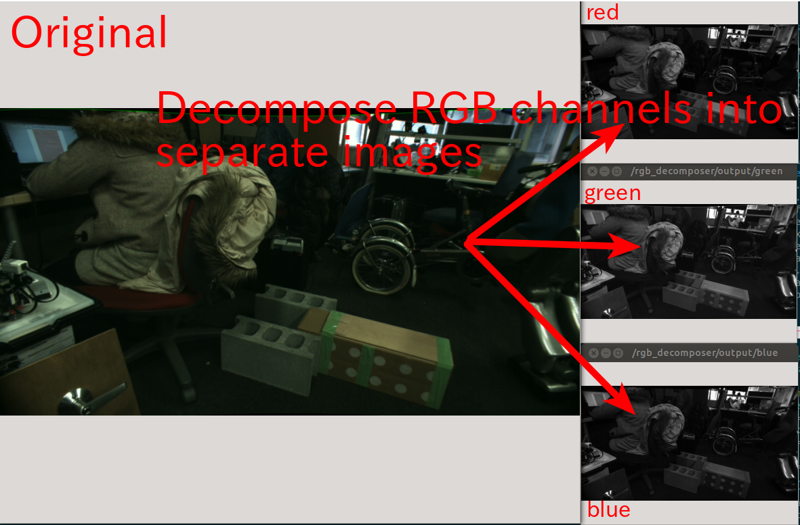

# RGBDecomposer


Split the original color image into 3 greyscale image of each color(RGB) strength.

## Subscribing Topic
* `~input` (`sensor_msgs/Image`)

  Divide input camera image into 3 image (R,G,B) according to its color info.

## Publishing Topic
* `~output/red` (`sensor_msgs/Image`)
* `~output/green` (`sensor_msgs/Image`)
* `~output/blue` (`sensor_msgs/Image`)

## Parameters
none

## Samples

```bash
roslaunch jsk_perception sample_rgb_decomposer.launch
```
