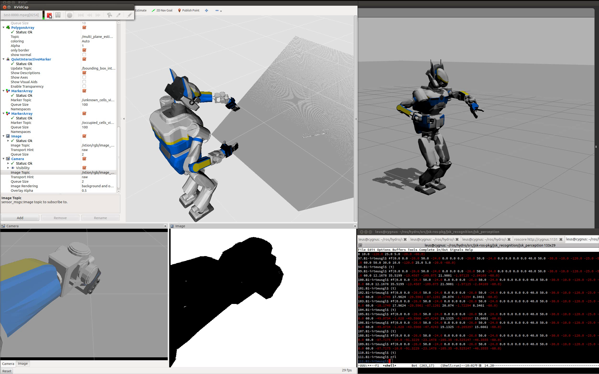

# RobotToMaskImage


Convert robot model into mask image.

## Subscribing Topic
* `~input/camera_info` (`sensor_msgs/CameraInfo`)

  Input camera info to project 3-D polygon.

## Publishing Topic
* `~output` (`sensor_msgs/Image`)

  Mask image to fill `~input` polygon.

## Parameters
* `~max_robot_dist` (Double, default: `10`)

  Maximum distance of robot from camera.

  Distance is in z-axis direction of the camera coordinates.

* `robot_description` (String, required)

  robot_description of the mask-generated robot.

* `~self_see_default_padding` (Double, default: `0.001`)

  Same as the parameter in pr2_navigation_self_filter.
  Padding of robot link for mask generation.

* `~self_see_default_scale` (Double, default: `1.0`)

  Same as the parameter in pr2_navigation_self_filter.
  Scale of robot link for mask generation.

* `~self_see_links` (Array of link configuration, required)

  Same as the parameter in pr2_navigation_self_filter.
  Configuration of links for mask generation.
  Link configuratin consists of name (required), padding (optional), and scale (optional).

## Samples

```bash
roslaunch jsk_perception sample_robot_to_mask_image.launch
```
