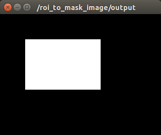

# ROIToMaskImage



Convert camera info with ROI to mask image.

## Subscribing Topic
* `~input` (`sensor_msgs/CameraInfo`)

  Input camera info with ROI filled.


## Publishing Topic
* `~output` (`sensor_msgs/Image`)

  Output mask image.

## Sample

```bash
roslaunch jsk_perception sample_roi_to_mask_image.launch
```
