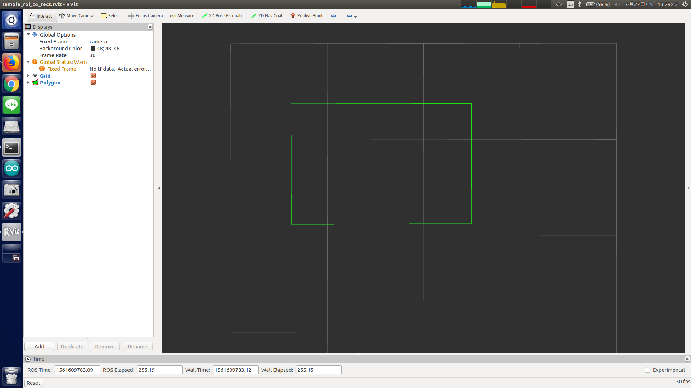

# ROIToRect



Convert camera info with ROI to 2D polygon.

## Subscribing Topic
* `~input` (`sensor_msgs/CameraInfo`)

  Input camera info with ROI filled.


## Publishing Topic
* `~output` (`geometry_msgs/PolygonStamped`)

  Output rectangle region.

  Position of each vertex is represented in [pixel].


## Sample

```bash
roslaunch jsk_perception sample_roi_to_rect.launch
```
