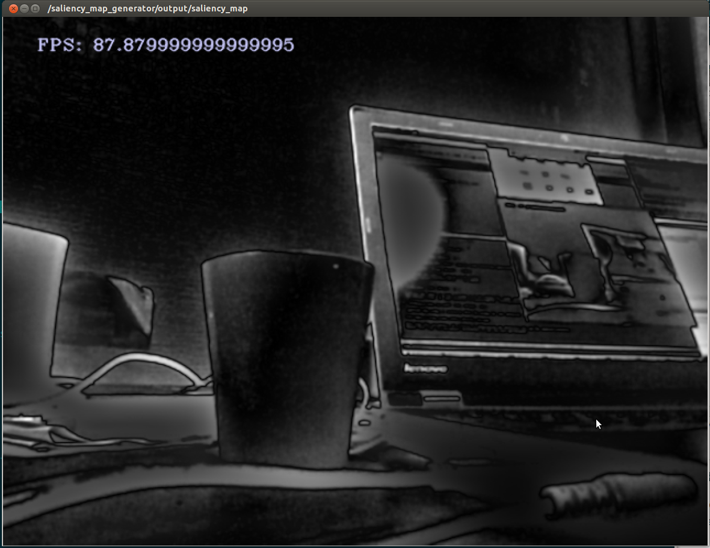

# SaliencyMapGenerator


This nodelet is used to compute the saliency of an image.

The image can be composed of any feature space. However, the current nodelet
takes only 3 channel BGR image and computes the saliency map.

The original code is implemented by the authors of the paper:
[Human detection using a mobile platform and novel features derived from a visual saliency mechanism](http://www.sciencedirect.com/science/article/pii/S0262885609001371).

Please cite this paper should you use the code.

However, there are minor changes from the original code
including the MultiThreading support using OpenMP.


## Subscribing Topic
* `~input` (`sensor_msgs/Image`)

  Currently only supports `BGR8` encoding (3 channel RGB intensity image)

## Publishing Topic
* `/saliency_map_generator/output/saliency_map` (`sensor_msgs/Image`)

  Output saliency map.

## Parameters
* `~num_threads` (Int, default: `2`)

  Number of threads used for execution

* `~fps` (Bool, default: `true`)

  Prints the frame rate to the output image if true.


## Sample

```bash
roslaunch jsk_perception sample_saliency_map_generator.launch
```
