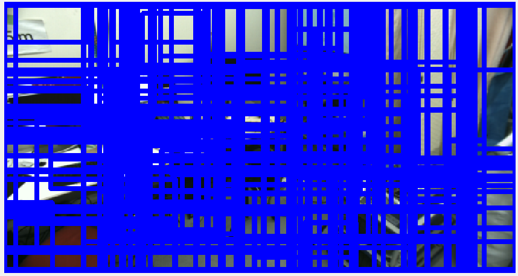

# selective_search.py

Segment image using Selective Search algorithm.
Segmentation result is published as `jsk_recognition_msgs/RectArray`

## Subscribing Topics
* `~input` (`sensor_msgs/Image`)

  Input image

## Published Topics
* `~output` (`jsk_recognition_msgs/RectArray`)

  Segmentated bounding box
* `~debug` (`sensor_msgs/Image`)

  Debug image

## Sample

```bash
roslaunch jsk_perception sample_selective_search.launch
```
