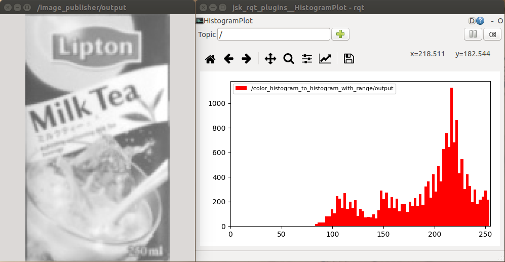

# SingleChannelHistogram



Compute histogram of single channel image.

## Subscribing Topic
* `~input` (`sensor_msgs/Image`)

  Input image. It should has CV_8UC1 as encoding.

* `~input/mask` (`sensor_msgs/Image`)

  Mask image. if `~use_mask` is true, histogram is computed with this mask image.


## Publishing Topic
* `~output` (`jsk_recognition_msgs/ColorHistogram`)

  Histogram of `~input` image.


## Parameters
* `~use_mask` (Boolean, default: `false`)

  If this parameter is set true, histogram is computed with mask image.

* `~hist_size` (Integer, default: `10`)

  The number of bins of histogram.

  This parameter can be changed by `dynamic_reconfigure`.

* `~min_value` (Double, default: `0.0`)
* `~max_value`(Double, default: `256.0`)

  Minimum and maximum value of histogram.

  These parameters can be changed by `dynamic_reconfigure`.


## Sample

```bash
roslaunch jsk_perception sample_single_channel_histogram.launch
```
