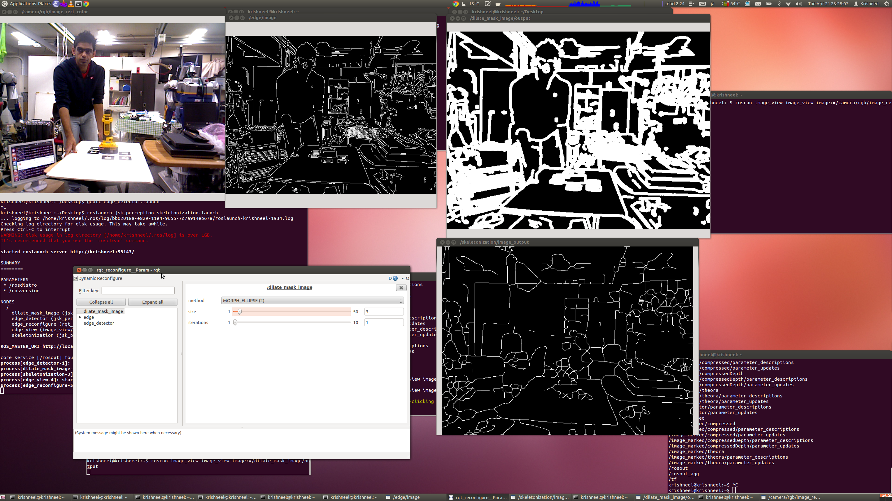

# Skeletonization


The nodelet is used to obtain the single pixel skeleton of either edges, contours or regions.

An important use of this nodelet is to fix broken edges on 2D image
by first applying Dilation operation to the edges such that the broken edges intersect.

By using skeletonization, the dilated image single pixel skeleton structure can be obtained.

Note that this is different from erosion, as erosion erodes the edges without preserving the structure.

For more information refer to [Wikipedia - Zhang-Suen thinning algorithm](http://rosettacode.org/wiki/Zhang-Suen_thinning_algorithm)


## Subscribing Topic
* `~input` (`sensor_msgs/Image`)

  Currently only supports "MONO8" (single channel 8 bit grayscale)


## Publishing Topic
* `~image_output` (`sensor_msgs/Image`)

  float image containing skeleton info of the input image. 1 presents the skeleton.

  The output is the message with encoding type of 32FC1.

  You may need rviz or latest image_view to display them.


## Parameters

* `~num_threads` (Int, default: `2`)

  Number of threads for multi-threading computation.


## Sample

```bash
roslaunch jsk_perception sample_skeletonization.launch
```
