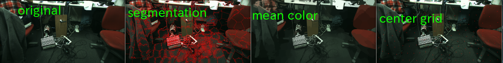

# SLICSuperPixels

Compute super pixels based on SLIC based on "SLIC Superpixels Compared to State-of-the-art Superpixel Methods" (TPAMI 2012).
jsk\_perception use implementation of https://github.com/PSMM/SLIC-Superpixels, https://github.com/berak/SLIC-Superpixels and https://github.com/garaemon/SLIC-SuperPixels.

Output of this node is an image and each value means label index.

## Subscribing Topic
* `image` (`sensor_msgs/Image`)

  Input image.
## Publishing Topic

* `~output` (`sensor_msgs/Image`)

  Output image. The encoding of image is `CV_32SC1` and each element value means label index.
* `~debug` (`sensor_msgs/Image`)

  Debug image, each border of cluster drawn by red contour.
* `~debug/mean_color` (`sensor_msgs/Image`)

  Debug image, each cluster is drawn by mean color of the cluster.
* `~debug/center_grid` (`sensor_msgs/Image`)

  Debug image, Center of each cluster is plotted by red dot.
## Parameters
* `~number_of_super_pixels` (Integer, default: `100`)

  The number of super pixels.
* `~weight` (Integer, default: `4`)

  Weight of metrics between color and pixel distance.
