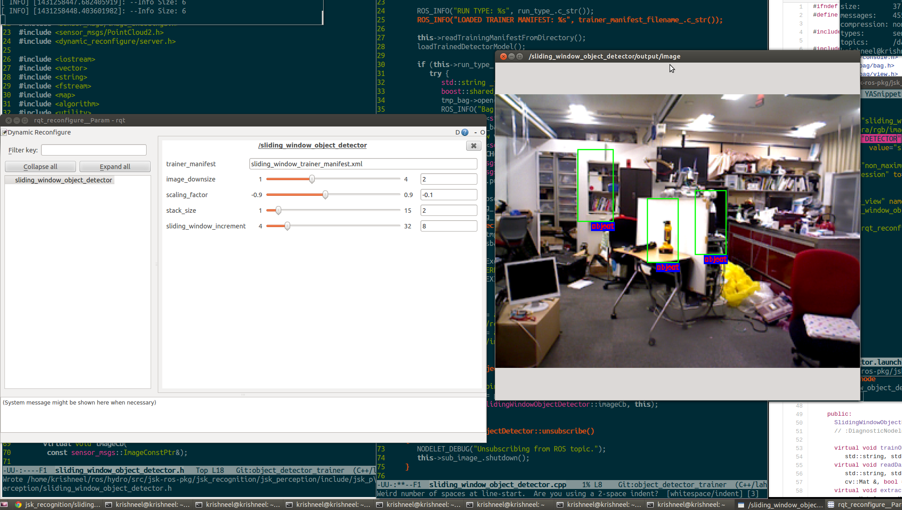
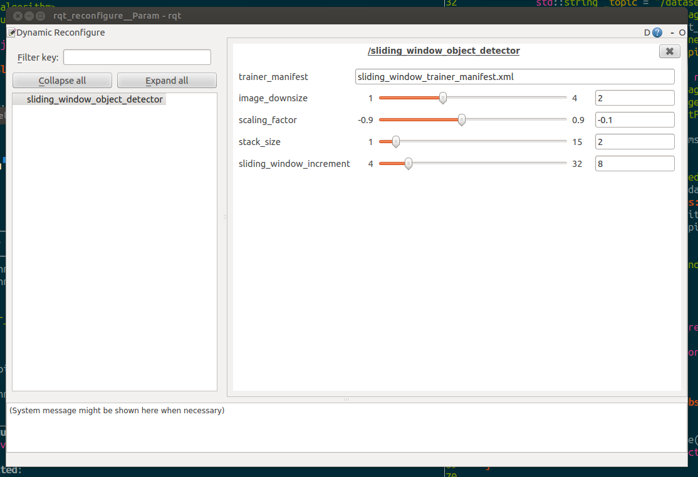

# SlidingWindowObjectDetector

## What is this?
This nodelet performs supervised object detection through binary support vector machine trained object classifier. The Nodelet uses a sliding window detection method as a raster scaning of the image. Currently, the detector is trained on Histogram of Oriented Gradients and HS Color histogram. To train this detector please use the custom implemented `jsk\_perception/SlidingWindowObjectDetectorTrainer` nodelet bundled in jsk_perception pkg.

Note that this nodelet reads a trainer manifest file, customed named to "sliding_window_trainer_manifest.xml" which is one of the outputs of SlidingWindowObjectDetectorTrainer. This manifest file contains specific configurations of the trainer, the feature dimensionalities, the detector window size and the output directories with filenames. 

## Usage

The nodelet can be configured to run as either:
* `1) a detector (DETECTOR)` - where the nodelet simply loads the manifest and trainer and performs object detection.
* `2) a bootstraper (BOOTSTRAPER)` - this mode, is used to refine the trained classifier by accumulating the false positive detection in the environment to re-train the detector. This method helps reduce the false positives. Note when doing bootstrapping make sure that the object of interest is `NOT` in the environment. The nodelet before doing bootstrapping will load the negative training bag file, read, and will write using the same name and will append the images from bootstrapping to the bag. This is done to set all training set to similar time stamps. 

## Subscribing Topic
* `~input` (`sensor_msgs/Image`)

  Input mask images.
## Publishing Topic
* `~output/image` (`sensor_msgs/Image`)

  Raw image marked with bounding boxes of detected objects.

* `~output/rects` (`jsk_recognition_msgs/RectArray`)

  Array of detected bounding boxes

## Parameters
* `~run_type` (string, default: `DETECTOR`)
  Run the nodelet as. see above

* `~image_downsize` (Int, default: `2`)

  Reduces the image by this factor. (Smaller image dimensions makes processing faster)

* `~scaling_factor` (float, default: `-0.06`)

  Scale factor for pymdical scaling of the window. 
  `+` value indices increase while `-` is reduces. 

* `~stack_size` (int, default: `2`)

  Spefices the number of times a window is to be changed for raster scanning. 
  The changed factor for each traversal is determined by `~scaling_factor`
  
* `~sliding_window_increment` (int, default: `16`)

  Spefices the number of pixels to shift the window for next detection. 

Note that this parameters are critical in determining the detection rate and the speed of execution. 
Please fine tune the parameters accordingly to get the best performance. 
  
