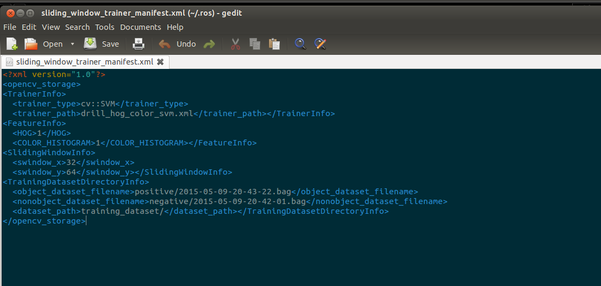

# sliding_window_object_detector_trainer_node

## What is this?
Node to train [jsk_perception/SlidingWindowObjectDetector](sliding_window_object_detector.md)
using binary support vector machine.

The object is assigned a label of +1 and -1 otherwise.
The SVM used is from the OpenCV Library with default set to RBF Kernel and 10-Fold Cross Validations.

## Parameters
* `~dataset_path` (string, required)

  Folder name where `~object_dataset_filename` and `~nonobject_dataset_filename` resides.

  It should end with `/`.

* `~object_dataset_filename` (string, required)

   Rosbag file name of the object (positive) training set.

   The bag file must contain `~object_dataset_topic` topic.

* `~object_dataset_topic` (string, default: `/dataset/roi`)

  Topic name of `sensor_msgs/Image` which is a set of positive training examples.

* `~nonobject_dataset_filename` (string, required)

   Rosbag file name of the non-object (negative) training set.

   The bag file must contain `~nonobject_dataset_topic` topic.

* `~nonobject_dataset_topic` (string, default: `/dataset/background/roi`)

  Topic name of `sensor_msgs/Image` which is a set of negative training examples.

* `~classifier_name` (string, required)

   Path to trained SVM classifier output file.

   `.xml` or `.yaml` format is supported.

* `~manifest_filename` (string, default: `sliding_window_trainer_manifest.xml`)

   Path to manifest file which contains parameters of the trainer
   such as trainer window size, save directory, etc.

   `.xml` or `.yaml` format is supported.

   

* `~swindow_x` (int, required)
* `~swindow_y` (int, required)

   Images in training dataset are resized to this size (width, height)
   before training SVM.

## Sample

```bash
roslaunch jsk_perception sample_sliding_window_object_detector_trainer.launch
```

and wait a few minutes until "Trained Successfully" message appears.
