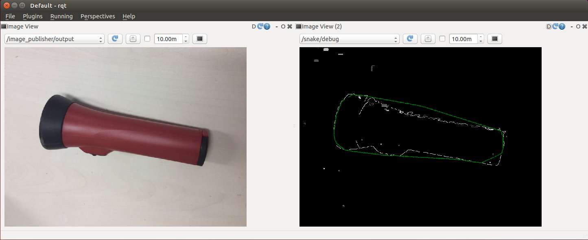

# SnakeSegmentation


Snake segmentation based on cvSnakeImage.

This feature is not supported in OpenCV >= 3.

## Subscribing Topics
* `~input` (`sensor_msgs/Image`)

  Input image.

## Publishing Topics
* `~debug` (`sensor_msgs/Image`)

  Debug image.

## Parameters
* `~alpha` (double, default: `0.1`)

  weight of connectivity energy

* `~beta` (double, default: `0.1`)

  weight of curvature energy

* `~gamma` (double, default: `0.1`)

  weight of image energy

* `~window_size` (Integer, default: `3`)
* `~max_iterations` (Integer, default: `1000`)
* `~epsilon` (double, default: `0.1`)

  epsilon value of convergence


## Sample

```bash
roslaunch jsk_perception sample_snake_segmentation.launch
```
