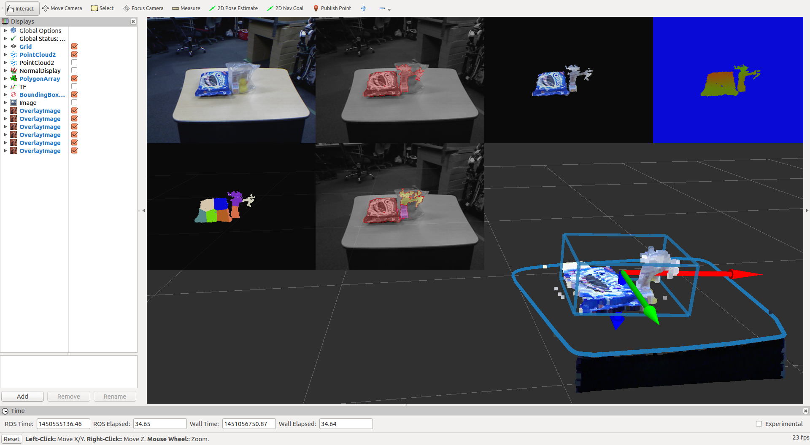

solidity_rag_merge.py
=====================

What is this?
-------------

(red region in top image is segmented using euclidean clustering, yellow, purple and red region is segmented by solidity_rag_merge.)

Segment image region which has high solidity, using `RAG <http://scikit-image.org/docs/dev/auto_examples/plot_rag.html>`_.
It firstly segments image with `SLIC Superpixels <http://ivrl.epfl.ch/research/superpixels>`_, generates RAG based on
solidity, and then merges regions.

Subscribing Topic
-----------------

* ``~input`` (``sensor_msgs/Image``)

  Raw image. In most cases, this is mask or depth image.

* ``~input/mask`` (``sensor_msgs/Image``)

  Region where the label should be ignored.

Publishing Topic
----------------

**Default Topics**

* ``~output`` (``sensor_msgs/Image``, encoding: `32SC1`)

  Label image of region with high solidity.

**Optional Topics**

Following topics are published when ``~debug`` is ``True``, see **Parameters** for more detail.

* ``~debug/slic`` (``sensor_msgs/Image``, encoding: `32SC1`)

  Label image segmented with SLIC Superpixels.

* ``~debug/rag`` (``sensor_msgs/Image``)

  RAG overlayed image.

* ``~debug/label_viz`` (``sensor_msgs/Image``)

  Label color overlayed image.
  This function can be replaced by `label_image_decomposer.py <label_image_decomposer>`_
  but I added for easy debugging.

Parameters
----------

* ``~approximate_sync`` (Bool, default: ``False``)

  Whether to use approximate for input topics.

* ``~debug`` (Bool, default: ``True``)

  Debug mode. In this mode, the node publishes `~debug/*` topics.
