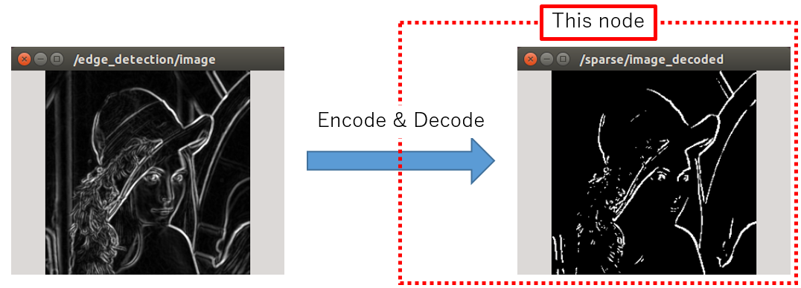

SparseImageDecoder
==================

What is this?
-------------

Decode ``jsk_recognition_msgs/SparseImage`` and publish it as a mask image.

The combination of ``jsk_perception/SparseImageEncoder`` and this node provides almost the same function as image thresholding.

Subscribing Topic
-----------------

* ``sparse_image`` (``jsk_recognition_msgs/SparseImage``)

  Input indices to decode.

Publishing Topic
----------------

* ``sparse/image_decoded`` (``sensor_msgs/Image``)

  Decoded mask image.

  The encoding is ``MONO8``.

Sample
------

.. code-block:: bash

  roslaunch jsk_perception sample_sparse_image_encoder_decoder.launch
