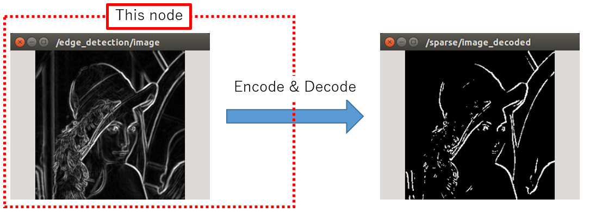

SparseImageEncoder
==================

What is this?
-------------

Pick up bright pixels from an image and encode the indices.

The combination of this node and ``jsk_perception/SparseImageDecoder`` provides almost the same function as image thresholding.

Note that this node is irrelevant to sparse coding or auto encoder.

Subscribing Topic
-----------------

* ``image`` (``sensor_msgs/Image``)

  Input image to encode.

Publishing Topic
----------------

* ``sparse_image`` (``jsk_recognition_msgs/SparseImage``)

  Encoded indices.

  If either width or height of the input image is greater than 256, ``data32`` field is used.

  If it is less than or equal to 256, then ``data16`` field is used instead.

Parameters
----------

* ``~rate`` (Float, default: ``3.0``)

  Maximum publishing rate [Hz].

* ``~print_point_num`` (Bool, default: ``False``)

  Print number of encoded pixels as NODELET_INFO.

Sample
------

.. code-block:: bash

  roslaunch jsk_perception sample_sparse_image_encoder_decoder.launch
