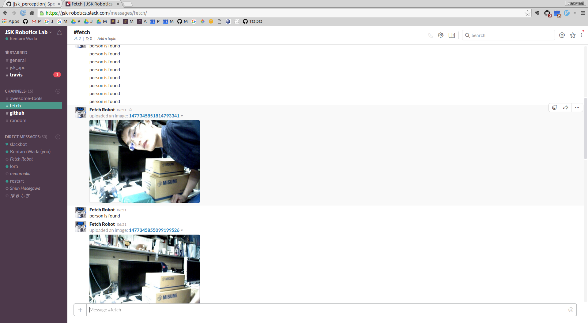

speak_when_label_found.py
=========================

What is this?
-------------

The **speak** means:

- Speak with `sound_play <http://wiki.ros.org/sound_play>`_.
- Publish ``std_msgs/String`` message.
- Publish ``jsk_gui_msgs/SlackMessage``.

And this node speaks if target labels are found in input label image.

Subscribing Topic
-----------------

* ``~input/label`` (``sensor_msgs/Image``)

  Label image to find target labels.

* ``~input/image`` (``sensor_msgs/Image``)

  Raw image which is used to speak with ``jsk_gui_msgs/SlackMessage``.

Publishing Topic
----------------

* ``~output/string`` (``std_msgs/String``)

  Output message with string.

* ``~output/slack_msg`` (``jsk_gui_msgs/SlackMessage``)

  Output message to post to slack.
  This node can be easily integrated with
  `jsk_tools/post_to_slack_server <https://github.com/jsk-ros-pkg/jsk_common/blob/2.2.0/jsk_tools/src/post_to_slack_server>`_.

Parameters
----------

* ``~label_names`` (List of String, required)

  The name of labels.

* ``~target_labels`` (List of Int, required if ``~target_label_names`` is not specified)
* ``~target_label_names`` (List of String, required if ``~target_labels`` is not specified)

  Target label.

* ``~sound`` (Bool, default: ``true``)

  Flag of using sound_play.

* ``~min_label_region`` (Float, default: ``0.1``)

  Threshold of label region to recognize as label is detected.

* ``~approximate_sync`` (Bool, default: ``False``)

  Whether to use approximate for input topics.

* ``~queue_size`` (Int, default: ``10``)

  How many messages you allow about the subscriber to keep in the queue.
  This should be big when there is much difference about delay between two topics.

* ``~slop`` (Float, default: ``0.1``)

  How many seconds you allow about the difference of timestamp
  when you specify ``~approximate_sync``.

Sample
------

.. code-block:: bash

   roslaunch jsk_perception sample_speak_when_label_found.launch
