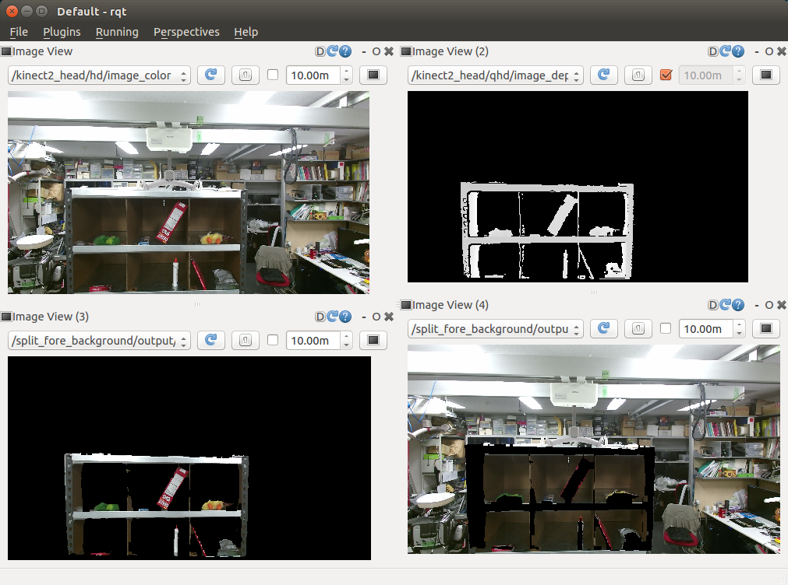

split_fore_background.py
========================

What is this?
-------------

Publish foreground and background mask image
splitted by local maximum of depth image.

Subscribing Topic
-----------------

* ``~input` (``sensor_msgs/Image``, encoding: ``16UC1`` or ``32FC1``)

  Depth image.

Publishing Topic
----------------

* ``~output/fg_mask`` (``sensor_msgs/Image``, encoding: ``8UC1``)

  Mask image to extract foreground.

* ``~output/bg_mask`` (``sensor_msgs/Image``, encoding: ``8UC1``)

  Mask image to extract background
