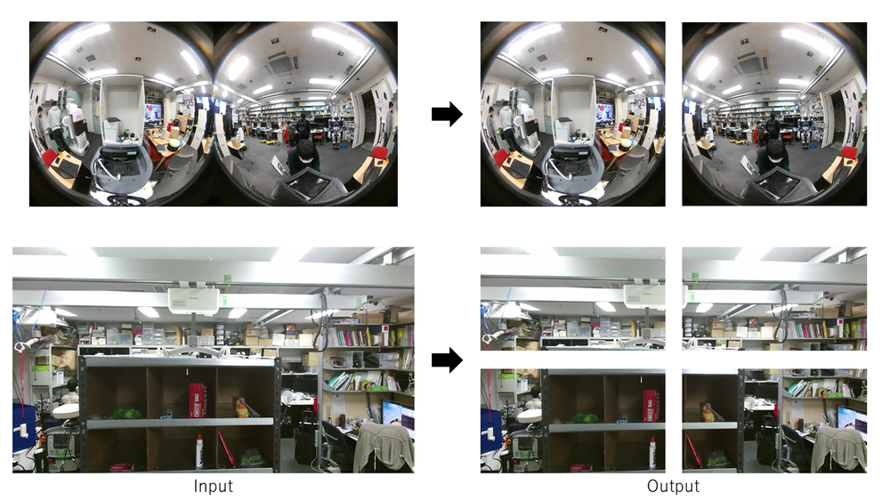

# split_image.py


## What Is This

Split the input image at equal intervals vertically and horizontally.

## Subscribing Topic

* `~input` (`sensor_msgs/Image`)

    Input image to be split.

## Publishing Topic

* `~output/vertical(vertical_index)/horizontal(horizontal_index)` (`sensor_msgs/Image`)

    Split images. The number of published topics is `~vertical_splits` * `~horizontal_splits`.

## Parameters

* `~vertical_splits` (int, default: 1)

    The number of parts the input image is split vertically.

* `~horizontal_splits` (int, default: 1)

    The number of parts the input image is split horizontally.

## Sample
```bash
roslaunch jsk_perception sample_split_image.launch
```
