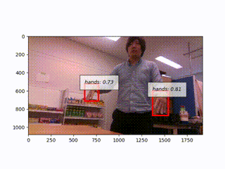

ssd_object_detector
====================


SSD (Single Shot Multibox Detector) object detector node

## Usage

### Predicting

``` bash
roslaunch jsk_perception sample_ssd_object_detector.launch gpu:=0
```

You can see camera image with results in `image_view`


- Publishing Topics:

    - `~output/image` (`sensor_msgs/Image`)

        Output image with bounding boxes

    - `~output/class` (`jsk_recognition_msgs/ClassificationResult`)

        Class information of detected objects

    - `~output/rect` (`jsk_recognition_msgs/RectArray`)

        Rectangles of detected objects

    - `~output/cluster_indices` (`jsk_recognition_msgs/ClusterPointIndices`)

        Image indices of each instance


- Subscribing Topics:

    - `~input` (`sensor_msgs/Image`)

        Input image

- Parameters:

    - `~classifier_name` (`String`, default: `rospy.get_name()`)

        Name of this classifier

    - `~gpu` (`Int`, default: `-1`)

        Index of gpu used for prediction. Set `-1` for using CPU.

    - `~model` (`String`, default: `ssd300`)

        Name of model structure.`ssd300` and `ssd512` are supported.

    - `~model_path` (`String`, default: `voc0712`)

        Name of pretrained model or path to trained model file.

    - `~label_names` (`String` or `String[]`, default: `[]`)

        Path to label yaml file or label names. If this parameter is not specified, use label of VOC dataset.

    - `~nms_thresh` (`Double`, default: `0.45`)

        Threshold for non maximum suppression

    - `~score_thresh` (`Double`, default: `0.60`)

        Threshold for confidence score

    - `~profiling` (`Bool`, default: `False`)

        Time profiling

### Training dataset

1. Prepare dataset

    Each dataset must have image files in one directory and one file which contains label names.

    ```yaml
    # label_names.yml
    - Apple
    - Bread
    - Candy
    - Drink
    - Egg
    ```

    ```bash
    ./dataset
     |- label_names.yml
     |- image0001.jpg
     |- image0002.jpg
     |- image0003.jpg
     |- image0004.jpg
     ...
     ```

2. Install annotation tool

    ```bash
    git clone https://github.com/yuyu2172/image-labelling-tool
    cd image-labelling-tool
    pip install -e .
    ```

3. Annotate dataset

    Launch annotation tool that is installed in the previous section.

    ```bash
    python ./image-labelling-tool/flask_app.py --image_dir dataset/ --label_names dataset/label_names.yml --file_ext jpg
    ```

    If annotation tool is launched successfully, you can see the message as follows:

    ```bash
    Loaded 90 images
     * Running on http://127.0.0.1:5000/ (Press CTRL+C to quit)
    ```

    Open `http://127.0.0.1:5000/` with web browser, and annotate dataset.
    After annotating images, `json` files should be generated in the same directory as images.

    ```bash
    jskuser@machine:~/dataset$ ls
    image0000.jpg           image0051__labels.json   image0102__labels.json  image0154.jpg
    image0000__labels.json  image0052.jpg            image0103.jpg           image0154__labels.json
    image0001.jpg           image0052__labels.json   image0103__labels.json  image0155.jpg
    image0001__labels.json  image0053.jpg            image0104.jpg           image0155__labels.json
    image0002.jpg           image0053__labels.json   image0104__labels.json  image0156.jpg
    image0002__labels.json  image0054.jpg            image0105.jpg           image0156__labels.json
    image0003.jpg           image0054__labels.json   image0105__labels.json  image0157.jpg
    image0003__labels.json  image0055.jpg            image0106.jpg           image0157__labels.json
    ...
    ```

4. Train from the annotated dataset

    ```bash
    cd dataset/
    rosrun jsk_perception ssd_train_dataset.py --gpu 0 dataset/label_names.yml dataset/
    ```

    When training process starts successfully, progress are shown on terminal as follows:

    ```
    Loaded 27 labels
    train: 112, test: 28
    epoch       iteration   lr          main/loss   main/loss/loc  main/loss/conf  validation/main/map
    0           10          0.0001      9.9525      1.16335        8.78914                              
    0           20          0.0001      6.11782     0.730058       5.38776                              
    1           30          0.0001      4.26923     0.511913       3.75732                              
    1           40          0.0001      4.01094     0.529855       3.48108                              
    2           50          0.0001      3.1616      0.37409        2.78751                              
    2           60          0.0001      2.80446     0.331363       2.4731                               
    3           70          0.0001      2.57667     0.348          2.22867                              
    3           80          0.0001      2.59318     0.350702       2.24248                              
    4           90          0.0001      2.31911     0.3307         1.98841                              
    4           100         0.0001      2.25847     0.285728       1.97274         0.737562             
    4           110         0.0001      2.09784     0.265645       1.8322                               
    5           120         0.0001      2.25548     0.309224       1.94626                              
    5           130         0.0001      2.22602     0.311586       1.91443                              
    6           140         0.0001      2.14396     0.332112       1.81185                              
    6           150         0.0001      1.95564     0.274048       1.68159                              
    7           160         0.0001      1.79976     0.273          1.52675                              
    ...
    ```

    Weight files are generated on every 200 iterations by default. (e.g. `result/model_iter_400` as a weight file after 400 iterations)
    You can monitor loss and stop training at anytime and resume with option `--resume`.

    A generated weight file can be used as model file for `ssd_object_detector.py` by setting `~model_path` parameter as path to the weight file.

## Pretrained Models

### Hand Detection

You can use pretrained hand detection models.

``` bash
roslaunch jsk_perception sample_ssd_hand_detector.launch gpu:=0
```



## Reference

- [Wei Liu, et al. "SSD: Single shot multibox detector" ECCV 2016](https://arxiv.org/abs/1512.02325)

- [ChainerCV SSD code](https://github.com/chainer/chainercv/tree/master/examples/ssd)

- [Image Labelling tools](https://github.com/yuyu2172/image-labelling-tool/tree/master/examples/ssd)

## Author

Yuki Furuta <<furushchev@jsk.imi.i.u-tokyo.ac.jp>>

Yusuke Niitani <<niitani@jsk.imi.i.u-tokyo.ac.jp>>
