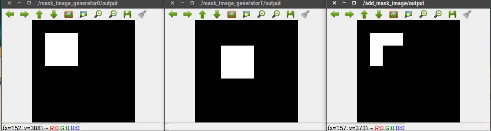

# SubtractMaskImage



Subtract one mask image from another.


## Subscribing Topic

* `~input/src1` (`sensor_msgs/Image`)
* `~input/src2` (`sensor_msgs/Image`)

  Input mask images.


## Publishing Topic

* `~output` (`sensor_msgs/Image`)

  Subtracted mask image. (output = input/src1 - input/src2)


## Parameters

* `~approximate_sync` (Bool, default: `false`)

  Approximately synchronize `~input/src1` and `~input/src2` if it's true.

* `~queue_size` (Int, default: `100`)

  Queue size


## Sample

```bash
roslaunch jsk_perception sample_subtract_mask_image.launch
```
